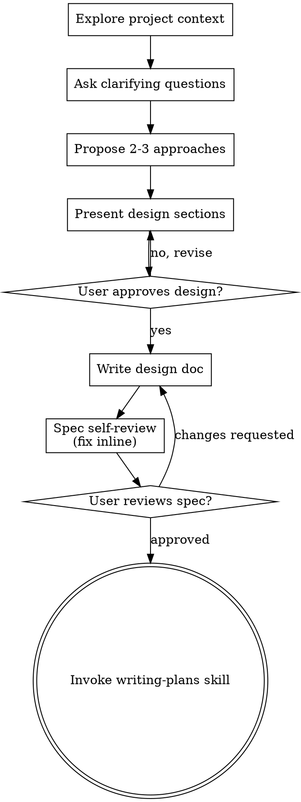

# Investiga mi repositorio, la idea es que sea autos
_Exported on 08/08/2026 at 13:31:17 GMT-3 from Claude via WayLog_


**User**

Investiga mi repositorio, la idea es que sea autosuficiente en la medida de lo posible, quiero que por ejemplo si tenemos hoy que traer todas las materias y su contenido del campus viejo con los endpoints viejos no sea necesario el dia de mañana porque fuimos autoaprendiendo con cada llamada, entonces si el dia de mañana deja de funcionar el campus viejo nosotros podamos reemplazarlo temporalmente de forma independiente en el ambito de informacion. Dime que opciones tenemos y creo que es conveniente que nosotros vayamos guardando info en el tiempo pero siempre mostrando lo que ofrece el campus, si mañana la conexion falla podemos mostrar la info guardada, cualquier cosa preguntame.

---


**User**

Base directory for this skill: C:\Users\Asus\.claude\plugins\cache\claude-plugins-official\superpowers\6.2.0\skills\brainstorming

# Brainstorming Ideas Into Designs

Help turn ideas into fully formed designs and specs through natural collaborative dialogue.

Start by understanding the current project context, then ask questions one at a time to refine the idea. Once you understand what you're building, present the design and get user approval.

<HARD-GATE>
Do NOT invoke any implementation skill, write any code, scaffold any project, or take any implementation action until you have presented a design and the user has approved it. This applies to EVERY project regardless of perceived simplicity.
</HARD-GATE>

## Anti-Pattern: "This Is Too Simple To Need A Design"

Every project goes through this process. A todo list, a single-function utility, a config change — all of them. "Simple" projects are where unexamined assumptions cause the most wasted work. The design can be short (a few sentences for truly simple projects), but you MUST present it and get approval.

## Checklist

You MUST create a task for each of these items and complete them in order:

1. **Explore project context** — check files, docs, recent commits
2. **Offer the visual companion just-in-time** — NOT upfront. The first time a question would genuinely be clearer shown than described, offer it then (its own message); on approval its browser tab opens for you. If no visual question ever arises, never offer it. See the Visual Companion section below.
3. **Ask clarifying questions** — one at a time, understand purpose/constraints/success criteria
4. **Propose 2-3 approaches** — with trade-offs and your recommendation
5. **Present design** — in sections scaled to their complexity, get user approval after each section
6. **Write design doc** — save to `docs/superpowers/specs/YYYY-MM-DD-<topic>-design.md` and commit
7. **Spec self-review** — quick inline check for placeholders, contradictions, ambiguity, scope (see below)
8. **User reviews written spec** — ask user to review the spec file before proceeding
9. **Transition to implementation** — invoke writing-plans skill to create implementation plan

## Process Flow



**The terminal state is invoking writing-plans.** Do NOT invoke frontend-design, mcp-builder, or any other implementation skill. The ONLY skill you invoke after brainstorming is writing-plans.

## The Process

**Understanding the idea:**

- Check out the current project state first (files, docs, recent commits)
- Before asking detailed questions, assess scope: if the request describes multiple independent subsystems (e.g., "build a platform with chat, file storage, billing, and analytics"), flag this immediately. Don't spend questions refining details of a project that needs to be decomposed first.
- If the project is too large for a single spec, help the user decompose into sub-projects: what are the independent pieces, how do they relate, what order should they be built? Then brainstorm the first sub-project through the normal design flow. Each sub-project gets its own spec → plan → implementation cycle.
- For appropriately-scoped projects, ask questions one at a time to refine the idea
- Prefer multiple choice questions when possible, but open-ended is fine too
- Only one question per message - if a topic needs more exploration, break it into multiple questions
- Focus on understanding: purpose, constraints, success criteria

**Exploring approaches:**

- Propose 2-3 different approaches with trade-offs
- Present options conversationally with your recommendation and reasoning
- Lead with your recommended option and explain why
- YAGNI ruthlessly - remove unnecessary features from every approach and design

**Presenting the design:**

- Once you believe you understand what you're building, present the design
- Scale each section to its complexity: a few sentences if straightforward, up to 200-300 words if nuanced
- Ask after each section whether it looks right so far
- Cover: architecture, components, data flow, error handling, testing
- Be ready to go back and clarify if something doesn't make sense

**Design for isolation and clarity:**

- Break the system into smaller units that each have one clear purpose, communicate through well-defined interfaces, and can be understood and tested independently
- For each unit, you should be able to answer: what does it do, how do you use it, and what does it depend on?
- Can someone understand what a unit does without reading its internals? Can you change the internals without breaking consumers? If not, the boundaries need work.
- Smaller, well-bounded units are also easier for you to work with - you reason better about code you can hold in context at once, and your edits are more reliable when files are focused. When a file grows large, that's often a signal that it's doing too much.

**Working in existing codebases:**

- Explore the current structure before proposing changes. Follow existing patterns.
- Where existing code has problems that affect the work (e.g., a file that's grown too large, unclear boundaries, tangled responsibilities), include targeted improvements as part of the design - the way a good developer improves code they're working in.
- Don't propose unrelated refactoring. Stay focused on what serves the current goal.

## After the Design

**Documentation:**

- Write the validated design (spec) to `docs/superpowers/specs/YYYY-MM-DD-<topic>-design.md`
  - (User preferences for spec location override this default)
- Use elements-of-style:writing-clearly-and-concisely skill if available
- Commit the design document to git

**Spec Self-Review:**
After writing the spec document, look at it with fresh eyes:

1. **Placeholder scan:** Any "TBD", "TODO", incomplete sections, or vague requirements? Fix them.
2. **Internal consistency:** Do any sections contradict each other? Does the architecture match the feature descriptions?
3. **Scope check:** Is this focused enough for a single implementation plan, or does it need decomposition?
4. **Ambiguity check:** Could any requirement be interpreted two different ways? If so, pick one and make it explicit.

Fix any issues inline. No need to re-review — just fix and move on.

**User Review Gate:**
After the spec review loop passes, ask the user to review the written spec before proceeding:

> "Spec written and committed to `<path>`. Please review it and let me know if you want to make any changes before we start writing out the implementation plan."

Wait for the user's response. If they request changes, make them and re-run the spec review loop. Only proceed once the user approves.

**Implementation:**

- Invoke the writing-plans skill to create a detailed implementation plan
- Do NOT invoke any other skill. writing-plans is the next step.

## Visual Companion

A browser-based companion for showing mockups, diagrams, and visual options during brainstorming. Available as a tool — not a mode. Accepting the companion means it's available for questions that benefit from visual treatment; it does NOT mean every question goes through the browser.

**Offering the companion (just-in-time):** Do NOT offer it upfront. Wait until a question would genuinely be clearer shown than told — a real mockup / layout / diagram question, not merely a UI *topic*. The first time that happens, offer it then, as its own message:
> "This next part might be easier if I show you — I can put together mockups, diagrams, and comparisons in a browser tab as we go. It's still new and can be token-intensive. Want me to? I'll open it for you."

**This offer MUST be its own message.** Only the offer — no clarifying question, summary, or other content. Wait for the user's response. If they accept, start the server with `--open` so their browser opens to the first screen automatically. If they decline, continue text-only and don't offer again unless they raise it.

**Per-question decision:** Even after the user accepts, decide FOR EACH QUESTION whether to use the browser or the terminal. The test: **would the user understand this better by seeing it than reading it?**

- **Use the browser** for content that IS visual — mockups, wireframes, layout comparisons, architecture diagrams, side-by-side visual designs
- **Use the terminal** for content that is text — requirements questions, conceptual choices, tradeoff lists, A/B/C/D text options, scope decisions

A question about a UI topic is not automatically a visual question. "What does personality mean in this context?" is a conceptual question — use the terminal. "Which wizard layout works better?" is a visual question — use the browser.

If they agree to the companion, read the detailed guide before proceeding:
`skills/brainstorming/visual-companion.md`

---


**Claude**

Con lo que investigué del repo (arquitectura scrape-based de Moodle, Supabase ya usado como store en `lib/supabase.ts`/`supabaseFetch`, cache en memoria de `lib/hooks.ts` que se pierde al recargar, y el mecanismo de sesión persistente con re-login automático en `app/api/auth/route.ts`) y tus respuestas, te propongo este diseño. Te lo tiro en secciones cortas.

## 1. Qué se cachea y dónde

Un cache genérico en Supabase, una sola tabla `moodle_cache`:

```
cache_key   text primary key   -- "course:123" | "courses:45678"
payload     jsonb              -- mismo JSON que hoy devuelven los endpoints
updated_at  timestamptz
```

- `course:<courseId>` → secciones/módulos de una materia (lo que hoy arma `app/api/course/route.ts`). Se comparte entre todos los alumnos de esa materia — no depende del usuario.
- `courses:<userid>` → lista de materias inscriptas del dashboard (lo que arma `lib/hooks.ts` vía `/api/moodle`). Por usuario, porque cada uno está inscripto en cosas distintas.

Una sola tabla clave-valor (en vez de tablas relacionales por sección/módulo) porque ya guardás el JSON completo hoy en memoria — no hay necesidad de normalizarlo, y mañana si querés cachear otra cosa (ej. catálogo) solo agregás un prefijo de key nuevo, sin migraciones.

¿Esto tiene sentido o preferís tablas más estructuradas?

---


**User**

Continua

---


**Claude**

## 2. Cuándo se escribe y cuándo se lee el respaldo

**Escritura (write-through):** cada vez que `app/api/course/route.ts` o el path de materias en `lib/hooks.ts`/`app/api/moodle/route.ts` traen datos frescos de Moodle con éxito, se guarda (upsert) esa respuesta en `moodle_cache` antes de devolverla al cliente. No bloquea la respuesta al usuario — se dispara en paralelo (fire-and-forget) para no sumar latencia.

**Lectura (fallback):** solo se consulta `moodle_cache` cuando la llamada a Moodle falla de una forma que indica "Moodle no responde", no cuando falla por otro motivo:

| Situación | ¿Fallback a cache? |
|---|---|
| `fetch` tira excepción (timeout, DNS, conexión rechazada) | Sí |
| Moodle responde 5xx | Sí |
| Moodle responde bien pero redirige a `/login/` (sesión vencida) | No — es un problema de sesión, no de disponibilidad. Se mantiene el flujo actual (`401 Sesión expirada` / re-login automático con `moodle_cred`) |
| Falta la cookie de sesión (`moodle_session_token`) | No — el usuario ni siquiera está logueado |

Esta distinción importa porque si mezclás "Moodle caído" con "tu sesión venció", terminás mostrándole contenido viejo a alguien que en realidad necesita volver a loguearse, y como elegiste que el fallback sea **silencioso**, ahí sí sería confuso.

¿Te cierra esta regla de "cuándo cae a cache"?

---


**User**

Continua

---


**Claude**

## 3. Cambios puntuales por endpoint

- **`app/api/course/route.ts`** (contenido de una materia): en el `catch` del fetch principal (y en el de `section.php` si aplica), en vez de devolver `{error}` directo, intenta `getCachedCourse(courseId)`. Si hay dato guardado, lo devuelve con la misma forma `{ data: sections, courseName }` que ya consume `useCourseContents`. Si no hay nada guardado, recién ahí devuelve el error como hoy. Tras un scrape exitoso, dispara `setCachedCourse(courseId, { sections, courseName })` sin esperar el resultado.

- **`app/api/moodle/route.ts`** (lista de materias vía AJAX, entre otros métodos): esto es un proxy genérico para *muchos* `methodname`, así que el cache solo aplica a los que nos interesan (`core_course_get_enrolled_courses_by_timeline_classification`, `core_enrol_get_users_courses`). Para el resto (mensajes, notificaciones, etc.) un fallo de red simplemente sigue devolviendo error — no tiene sentido "cachear" un envío de mensaje. El `userid` para la key sale de la cookie `moodle_user`, que este route ya podría leer.

- **`app/api/courses/route.ts`** (scrape de respaldo que ya existe hoy): mismo patrón — si el `fetch` a `/my/courses.php` falla por red, cae a `getCachedCourses(userid)`.

- **`lib/contentCache.ts`** (nuevo): un módulo chico con 4 funciones (`getCachedCourse`, `setCachedCourse`, `getCachedCourses`, `setCachedCourses`) que envuelven `supabaseFetch` sobre `moodle_cache`, siguiendo el mismo estilo que ya usan `lib/deviceSessions.ts` o `lib/loginEvents.ts`.

## 4. Sesiones más resistentes

Vos elegiste "extender sesiones agresivamente". El mecanismo de re-login con `moodle_cred` (`app/api/auth/route.ts`) ya tolera bien que Moodle esté caído momentáneamente (si `refreshMoodleSession` tira error de red, devuelve `{ok:true, stale:true}` y no mata la sesión). Lo que realmente limita esto hoy es `REMEMBER_MAX_AGE = 30 días` en `lib/cookies.ts`, y que si el usuario no tildó "recordarme" la cookie es de sesión de navegador (sin `maxAge`). Propongo:
- Subir `REMEMBER_MAX_AGE` a algo más largo (ej. 90 días).
- Que el login guarde `moodle_cred` y use cookies persistentes **siempre**, no solo cuando `remember` está tildado — así cualquier usuario logueado sobrevive un corte prolongado de Moodle, no solo el que marcó la casilla.

¿Querés que el checkbox "recordarme" desaparezca (todos quedan logueados largo plazo) o preferís mantenerlo pero solo para la duración de la cookie visible/no-httpOnly (`moodle_user`), y las credenciales cifradas se guarden siempre?

---


**User**

Mantengamoslo

---


**Claude**

Entendido — mantenemos el checkbox "recordarme" tal cual funciona hoy (solo persiste sesión si el usuario lo marca). El único cambio en esta área queda en subir `REMEMBER_MAX_AGE` de 30 a 90 días para que, quien sí lo marcó, aguante cortes más largos.

## 5. Testing y verificación

No hay suite de tests en el proyecto, así que la verificación es manual:
1. Con Moodle arriba: entrar a una materia, confirmar que `moodle_cache` en Supabase recibe la fila `course:<id>` después de cargar.
2. Simular caída: cambiar temporalmente `MOODLE_BASE` a una URL que no resuelve (o cortar la red), recargar la misma materia y el dashboard, confirmar que se sigue viendo el contenido (silencioso, sin mensaje de error) usando lo guardado.
3. Confirmar que un error real de sesión (borrar cookies) sigue mostrando el flujo normal de login, no contenido cacheado.

## Resumen de alcance (para que lo confirmes antes de escribir el spec)

- Tabla nueva `moodle_cache` (key/value) en Supabase.
- `lib/contentCache.ts` con helpers de lectura/escritura.
- Write-through + fallback en `app/api/course/route.ts`, `app/api/courses/route.ts`, y en `app/api/moodle/route.ts` (solo para los 2 métodos de listado de cursos).
- Fallback solo ante fallas de red/5xx, nunca ante problemas de sesión/auth.
- Fallback silencioso (sin aviso de "datos guardados").
- `REMEMBER_MAX_AGE` 30 → 90 días.
- Catálogo de matriculación y archivos quedan fuera de este alcance (fase futura si hace falta).

¿Cerramos así el diseño para pasarlo al spec, o falta algo?

---


**User**

Continua

---


**Claude**

Ahora escribo el spec siguiendo ese mismo estilo.

---


**Claude**

Spec escrito y commiteado en [docs/superpowers/specs/2026-08-08-cache-respaldo-campus-viejo-design.md](docs/superpowers/specs/2026-08-08-cache-respaldo-campus-viejo-design.md).

Nota: el commit quedó en la rama `feature/contactar-profesor` (no `main`) porque es la rama en la que estabas parado, y hay un cambio sin commitear en `app/chat/page.tsx` que no toqué.

Revisá el spec cuando puedas y avisame si querés ajustar algo antes de pasar al plan de implementación.

---


**User**

Continua

---


**User**

Base directory for this skill: C:\Users\Asus\.claude\plugins\cache\claude-plugins-official\superpowers\6.2.0\skills\writing-plans

# Writing Plans

## Overview

Write comprehensive implementation plans assuming the engineer has zero context for our codebase and questionable taste. Document everything they need to know: which files to touch for each task, code, testing, docs they might need to check, how to test it. Give them the whole plan as bite-sized tasks. DRY. YAGNI. TDD. Frequent commits.

Assume they are a skilled developer, but know almost nothing about our toolset or problem domain. Assume they don't know good test design very well.

**Announce at start:** "I'm using the writing-plans skill to create the implementation plan."

**Context:** If working in an isolated worktree, it should have been created via the `superpowers:using-git-worktrees` skill at execution time.

**Save plans to:** `docs/superpowers/plans/YYYY-MM-DD-<feature-name>.md`
- (User preferences for plan location override this default)

## Scope Check

If the spec covers multiple independent subsystems, it should have been broken into sub-project specs during brainstorming. If it wasn't, suggest breaking this into separate plans — one per subsystem. Each plan should produce working, testable software on its own.

## File Structure

Before defining tasks, map out which files will be created or modified and what each one is responsible for. This is where decomposition decisions get locked in.

- Design units with clear boundaries and well-defined interfaces. Each file should have one clear responsibility.
- You reason best about code you can hold in context at once, and your edits are more reliable when files are focused. Prefer smaller, focused files over large ones that do too much.
- Files that change together should live together. Split by responsibility, not by technical layer.
- In existing codebases, follow established patterns. If the codebase uses large files, don't unilaterally restructure - but if a file you're modifying has grown unwieldy, including a split in the plan is reasonable.

This structure informs the task decomposition. Each task should produce self-contained changes that make sense independently.

## Task Right-Sizing

A task is the smallest unit that carries its own test cycle and is worth a
fresh reviewer's gate. When drawing task boundaries: fold setup,
configuration, scaffolding, and documentation steps into the task whose
deliverable needs them; split only where a reviewer could meaningfully
reject one task while approving its neighbor. Each task ends with an
independently testable deliverable.

## Bite-Sized Task Granularity

**Each step is one action (2-5 minutes):**
- "Write the failing test" - step
- "Run it to make sure it fails" - step
- "Implement the minimal code to make the test pass" - step
- "Run the tests and make sure they pass" - step
- "Commit" - step

## Plan Document Header

**Every plan MUST start with this header:**

```markdown
# [Feature Name] Implementation Plan

> **For agentic workers:** REQUIRED SUB-SKILL: Use superpowers:subagent-driven-development (recommended) or superpowers:executing-plans to implement this plan task-by-task. Steps use checkbox (`- [ ]`) syntax for tracking.

**Goal:** [One sentence describing what this builds]

**Architecture:** [2-3 sentences about approach]

**Tech Stack:** [Key technologies/libraries]

## Global Constraints

[The spec's project-wide requirements — version floors, dependency limits,
naming and copy rules, platform requirements — one line each, with exact
values copied verbatim from the spec. Every task's requirements implicitly
include this section.]

---
```

## Task Structure

````markdown
### Task N: [Component Name]

**Files:**
- Create: `exact/path/to/file.py`
- Modify: `exact/path/to/existing.py:123-145`
- Test: `tests/exact/path/to/test.py`

**Interfaces:**
- Consumes: [what this task uses from earlier tasks — exact signatures]
- Produces: [what later tasks rely on — exact function names, parameter
  and return types. A task's implementer sees only their own task; this
  block is how they learn the names and types neighboring tasks use.]

- [ ] **Step 1: Write the failing test**

```python
def test_specific_behavior():
    result = function(input)
    assert result == expected
```

- [ ] **Step 2: Run test to verify it fails**

Run: `pytest tests/path/test.py::test_name -v`
Expected: FAIL with "function not defined"

- [ ] **Step 3: Write minimal implementation**

```python
def function(input):
    return expected
```

- [ ] **Step 4: Run test to verify it passes**

Run: `pytest tests/path/test.py::test_name -v`
Expected: PASS

- [ ] **Step 5: Commit**

```bash
git add tests/path/test.py src/path/file.py
git commit -m "feat: add specific feature"
```
````

## No Placeholders

Every step must contain the actual content an engineer needs. These are **plan failures** — never write them:
- "TBD", "TODO", "implement later", "fill in details"
- "Add appropriate error handling" / "add validation" / "handle edge cases"
- "Write tests for the above" (without actual test code)
- "Similar to Task N" (repeat the code — the engineer may be reading tasks out of order)
- Steps that describe what to do without showing how (code blocks required for code steps)
- References to types, functions, or methods not defined in any task

## Self-Review

After writing the complete plan, look at the spec with fresh eyes and check the plan against it. This is a checklist you run yourself — not a subagent dispatch.

**1. Spec coverage:** Skim each section/requirement in the spec. Can you point to a task that implements it? List any gaps.

**2. Placeholder scan:** Search your plan for red flags — any of the patterns from the "No Placeholders" section above. Fix them.

**3. Type consistency:** Do the types, method signatures, and property names you used in later tasks match what you defined in earlier tasks? A function called `clearLayers()` in Task 3 but `clearFullLayers()` in Task 7 is a bug.

If you find issues, fix them inline. No need to re-review — just fix and move on. If you find a spec requirement with no task, add the task.

## Execution Handoff

After saving the plan, offer execution choice:

**"Plan complete and saved to `docs/superpowers/plans/<filename>.md`. Two execution options:**

**1. Subagent-Driven (recommended)** - I dispatch a fresh subagent per task, review between tasks, fast iteration

**2. Inline Execution** - Execute tasks in this session using executing-plans, batch execution with checkpoints

**Which approach?"**

**If Subagent-Driven chosen:**
- **REQUIRED SUB-SKILL:** Use superpowers:subagent-driven-development
- Fresh subagent per task + two-stage review

**If Inline Execution chosen:**
- **REQUIRED SUB-SKILL:** Use superpowers:executing-plans
- Batch execution with checkpoints for review

---


**Claude**

Buen patrón para seguir. Ahora escribo el plan completo.

---


**Claude**

I need to insert an additional step in Task 3 for the 5xx check. Let me view the exact current text around that section.

---


**Claude**

Ahora inserto un paso nuevo para tratar los 5xx de Moodle como caída (para que también disparen el fallback), renumerando los pasos siguientes.

---


**Claude**

Ahora renumero los pasos 3-5 restantes de esta tarea a 5-7.

---


**Claude**

Task 3 quedó bien numerada (1-7). Ahora agrego el mismo chequeo de 5xx en Task 4 (courses/route.ts) y Task 5 (moodle/route.ts).

---


**Claude**

I'll add the 5xx check directly into this replacement block (simpler than inserting another step) and update numbering for later steps.

---


**Claude**

Ahora Task 5 (moodle/route.ts) — agrego el mismo chequeo de 5xx.

---


**Claude**

Plan completo y guardado en [docs/superpowers/plans/2026-08-08-cache-respaldo-campus-viejo.md](docs/superpowers/plans/2026-08-08-cache-respaldo-campus-viejo.md), 7 tareas: tabla Supabase, helpers de cache, wiring en los 3 endpoints (con manejo explícito de 5xx además de errores de red), y la extensión de `REMEMBER_MAX_AGE`.

Dos opciones para ejecutarlo:

1. **Subagent-driven (recomendado)** — despacho un subagente fresco por tarea, con revisión entre cada una.
2. **Ejecución inline** — lo corro yo mismo en esta sesión, en bloques con checkpoints para que revises.

¿Cuál preferís?

---


**User**

2

---


**User**

Base directory for this skill: C:\Users\Asus\.claude\plugins\cache\claude-plugins-official\superpowers\6.2.0\skills\executing-plans

# Executing Plans

## Overview

Load plan, review critically, execute all tasks, report when complete.

**Announce at start:** "I'm using the executing-plans skill to implement this plan."

**Note:** Tell your human partner that Superpowers works much better with access to subagents (Claude Code, Codex CLI, Codex App, Copilot CLI, and Gemini CLI all qualify; see the per-platform tool refs in `../using-superpowers/references/`). If subagents are available, use superpowers:subagent-driven-development instead of this skill.

## The Process

### Step 1: Load and Review Plan
1. Ensure an isolated workspace: use superpowers:using-git-worktrees to create one or verify the existing one
2. Read plan file
3. Review critically - identify any questions or concerns about the plan
4. If concerns: Raise them with your human partner before starting
5. If no concerns: Create todos for the plan items and proceed

### Step 2: Execute Tasks

For each task:
1. Mark as in_progress
2. Follow each step exactly (plan has bite-sized steps)
3. Run verifications as specified
4. Mark as completed

### Step 3: Complete Development

After all tasks complete and verified:
- Announce: "I'm using the finishing-a-development-branch skill to complete this work."
- **REQUIRED SUB-SKILL:** Use superpowers:finishing-a-development-branch
- Follow that skill to verify tests, present options, execute choice

## When to Stop and Ask for Help

**STOP executing immediately when:**
- Hit a blocker (missing dependency, test fails, instruction unclear)
- Plan has critical gaps preventing starting
- You don't understand an instruction
- Verification fails repeatedly

**Ask for clarification rather than guessing.**

## When to Revisit Earlier Steps

**Return to Review (Step 1) when:**
- Partner updates the plan based on your feedback
- Fundamental approach needs rethinking

**Don't force through blockers** - stop and ask.

## Remember
- Review plan critically first
- Follow plan steps exactly
- Don't skip verifications
- Reference skills when plan says to
- Stop when blocked, don't guess
- Never start implementation on main/master branch without explicit user consent

---


**Claude**

El branch actual (`feature/contactar-profesor`) tiene cambios sin commitear en `lib/moodle.ts` y `components/ContactProfessorModal.tsx` que no son míos. Antes de tocar nada creo un worktree aislado para este trabajo, así no se mezcla con tu feature en progreso.

---


**User**

Base directory for this skill: C:\Users\Asus\.claude\plugins\cache\claude-plugins-official\superpowers\6.2.0\skills\using-git-worktrees

# Using Git Worktrees

## Overview

Ensure work happens in an isolated workspace. Prefer your platform's native worktree tools. Fall back to manual git worktrees only when no native tool is available.

**Core principle:** Detect existing isolation first. Then use native tools. Then fall back to git. Never fight the harness.

**Announce at start:** "I'm using the using-git-worktrees skill to set up an isolated workspace."

## Step 0: Detect Existing Isolation

**Before creating anything, check if you are already in an isolated workspace.**

```bash
GIT_DIR=$(cd "$(git rev-parse --git-dir)" 2>/dev/null && pwd -P)
GIT_COMMON=$(cd "$(git rev-parse --git-common-dir)" 2>/dev/null && pwd -P)
BRANCH=$(git branch --show-current)
```

**Submodule guard:** `GIT_DIR != GIT_COMMON` is also true inside git submodules. Before concluding "already in a worktree," verify you are not in a submodule:

```bash
# If this returns a path, you're in a submodule, not a worktree — treat as normal repo
git rev-parse --show-superproject-working-tree 2>/dev/null
```

**If `GIT_DIR != GIT_COMMON` (and not a submodule):** You are already in a linked worktree. Skip to Step 2 (Project Setup). Do NOT create another worktree.

Report with branch state:
- On a branch: "Already in isolated workspace at `<path>` on branch `<name>`."
- Detached HEAD: "Already in isolated workspace at `<path>` (detached HEAD, externally managed). Branch creation needed at finish time."

**If `GIT_DIR == GIT_COMMON` (or in a submodule):** You are in a normal repo checkout.

Has the user already indicated their worktree preference in your instructions? If not, ask for consent before creating a worktree:

> "Would you like me to set up an isolated worktree? It protects your current branch from changes."

Honor any existing declared preference without asking. If the user declines consent, work in place and skip to Step 2.

## Step 1: Create Isolated Workspace

**You have two mechanisms. Try them in this order.**

### 1a. Native Worktree Tools (preferred)

The user has asked for an isolated workspace (Step 0 consent). Do you already have a way to create a worktree? It might be a tool with a name like `EnterWorktree`, `WorktreeCreate`, a `/worktree` command, or a `--worktree` flag. If you do, use it and skip to Step 2.

Native tools handle directory placement, branch creation, and cleanup automatically. Using `git worktree add` when you have a native tool creates phantom state your harness can't see or manage.

Only proceed to Step 1b if you have no native worktree tool available.

### 1b. Git Worktree Fallback

**Only use this if Step 1a does not apply** — you have no native worktree tool available. Create a worktree manually using git.

#### Directory Selection

Follow this priority order. Explicit user preference always beats observed filesystem state.

1. **Check your instructions for a declared worktree directory preference.** If the user has already specified one, use it without asking.

2. **Check for an existing project-local worktree directory:**
   ```bash
   ls -d .worktrees 2>/dev/null     # Preferred (hidden)
   ls -d worktrees 2>/dev/null      # Alternative
   ```
   If found, use it. If both exist, `.worktrees` wins.

3. **If there is no other guidance available**, default to `.worktrees/` at the project root.

#### Safety Verification (project-local directories only)

**MUST verify directory is ignored before creating worktree:**

```bash
git check-ignore -q .worktrees 2>/dev/null || git check-ignore -q worktrees 2>/dev/null
```

**If NOT ignored:** Add to .gitignore, commit the change, then proceed.

**Why critical:** Prevents accidentally committing worktree contents to repository.

#### Create the Worktree

```bash
# Determine path based on chosen location
path="$LOCATION/$BRANCH_NAME"

git worktree add "$path" -b "$BRANCH_NAME"
cd "$path"
```

**Sandbox fallback:** If `git worktree add` fails with a permission error (sandbox denial), tell the user the sandbox blocked worktree creation and you're working in the current directory instead. Then run setup and baseline tests in place.

## Step 2: Project Setup

Auto-detect and run appropriate setup:

```bash
# Node.js
if [ -f package.json ]; then npm install; fi

# Rust
if [ -f Cargo.toml ]; then cargo build; fi

# Python
if [ -f requirements.txt ]; then pip install -r requirements.txt; fi
if [ -f pyproject.toml ]; then poetry install; fi

# Go
if [ -f go.mod ]; then go mod download; fi
```

## Step 3: Verify Clean Baseline

Run tests to ensure workspace starts clean:

```bash
# Use project-appropriate command
npm test / cargo test / pytest / go test ./...
```

**If tests fail:** Report failures, ask whether to proceed or investigate.

**If tests pass:** Report ready.

### Report

```
Worktree ready at <full-path>
Tests passing (<N> tests, 0 failures)
Ready to implement <feature-name>
```

## Quick Reference

| Situation | Action |
|-----------|--------|
| Already in linked worktree | Skip creation (Step 0) |
| In a submodule | Treat as normal repo (Step 0 guard) |
| Native worktree tool available | Use it (Step 1a) |
| No native tool | Git worktree fallback (Step 1b) |
| `.worktrees/` exists | Use it (verify ignored) |
| `worktrees/` exists | Use it (verify ignored) |
| Both exist | Use `.worktrees/` |
| Neither exists | Check instruction file, then default `.worktrees/` |
| Directory not ignored | Add to .gitignore + commit |
| Permission error on create | Sandbox fallback, work in place |
| Tests fail during baseline | Report failures + ask |
| No package.json/Cargo.toml | Skip dependency install |

## Common Rationalizations

| Excuse | Reality |
|--------|---------|
| "I'm obviously not in a worktree — no need to check" | Run Step 0. Harness-created isolation and submodules both fool eyeballing; the detection commands settle it. |
| "`git worktree add` is quicker than hunting for a native tool" | A native tool (e.g. `EnterWorktree`) owns placement, branching, and cleanup. Bypassing it is the #1 mistake — it creates phantom state your harness can't see or manage. |
| "The worktree directory is surely ignored already" | Run `git check-ignore`. An unignored worktree directory commits the whole tree into the repo. |
| "Any directory name works" | Explicit instructions beat an existing project-local directory, which beats the `.worktrees/` default. |
| "The workspace is fresh — baseline tests can wait" | A dirty baseline makes every later failure ambiguous. Run the tests now; proceeding past failures is your human partner's call. |

---


**Claude**

No estamos en un worktree aislado. ¿Querés que cree uno para este trabajo, así no se mezcla con los cambios sin commitear de tu feature actual?

---


**Claude**

Voy a implementar el plan en este mismo branch (`feature/contactar-profesor`), sin tocar `lib/moodle.ts` más allá de lo que el plan pide, para no interferir con tus cambios pendientes ahí.

Primero, Task 1 requiere una acción manual tuya en Supabase — no tengo credenciales de conexión directa a Postgres (solo la REST API), así que no puedo correr DDL yo mismo. Necesito que ejecutes esto en el SQL Editor del dashboard de Supabase:

---


**Claude**

Ya tengo el project ref (`touegbkvmjboynyisdxb`) de tu `SUPABASE_URL` existente, así que solo falta una credencial nueva.

**La SQL** (para correr ahora en el SQL Editor del dashboard):

```sql
create table moodle_cache (
  cache_key text primary key,
  payload jsonb not null,
  updated_at timestamptz not null default now()
);
```

**Para que la próxima vez la corra yo solo**, necesito un **Personal Access Token** de Supabase (no es el `SUPABASE_SERVICE_ROLE_KEY` que ya tenés — ese solo sirve para la REST API de datos, no para crear tablas):

1. Andá a https://supabase.com/dashboard/account/tokens → "Generate new token".
2. Copiá el token y agregalo a tu `.env.local` como `SUPABASE_ACCESS_TOKEN=sbp_...` (nunca se commitea, ya está en el mismo lugar que el resto de tus secretos).

Con eso, la próxima vez puedo ejecutar DDL así, sin pedirte nada manual:

```bash
curl -s -X POST "https://api.supabase.com/v1/projects/touegbkvmjboynyisdxb/database/query" \
  -H "Authorization: Bearer $SUPABASE_ACCESS_TOKEN" \
  -H "Content-Type: application/json" \
  -d '{"query": "create table moodle_cache (cache_key text primary key, payload jsonb not null, updated_at timestamptz not null default now());"}'
```

**Ojo con el alcance**: un Personal Access Token es a nivel de cuenta — puede administrar *todos* tus proyectos de Supabase (crear/borrar tablas, cambiar configuración, etc.), no solo este. Es más poderoso que el `service_role key` actual. Si preferís algo más acotado a este proyecto, la alternativa es la connection string de Postgres (Project Settings → Database → Connection string) guardada como `SUPABASE_DB_URL`, pero ahí necesitaría instalar el paquete `pg` como dependencia nueva para poder usarla.

Mientras tanto sigo con el código (Tasks 2-7) — el cache queda escrito para degradar en silencio si la tabla todavía no existe.

---


**Claude**

No hay errores relacionados a este archivo. Commit y sigo con Task 3.

---


**Claude**

Ahora Task 3: `app/api/course/route.ts`.

---


**Claude**

Bien, no cambió esa parte relevante. Sigo con los dos edits del plan.

---


**Claude**

Sin errores de tipo. Commiteo Task 3 y sigo con Task 4.

---


**Claude**

File no cambió; aplico el plan tal cual.

---


**Claude**

Ahora Task 5, `app/api/moodle/route.ts`. Reviso el archivo actual por si tiene cambios respecto a lo que leí antes.

---


**Claude**

Idéntico a lo previsto. Aplico los cambios del plan.

---


**Claude**

Todos preexistentes, ninguno en los archivos que toqué. Commiteo Task 5.

---


**Claude**

Task 6: extender `REMEMBER_MAX_AGE`.

---


**User**

YA EJECUTE: create table moodle_cache (
  cache_key text primary key,
  payload jsonb not null,
  updated_at timestamptz not null default now()
);
 Y ACA ESTA EL TOKEN: [REDACTED]

---


**Claude**

Bien, `.env*` está en `.gitignore`. Guardo el token en `.env.local` (no lo voy a repetir en mensajes).

---


**Claude**

Ahora verifico que la tabla exista de verdad, usando el token (sin volver a mostrarlo en la salida).

---


**Claude**

La tabla `moodle_cache` existe con el esquema correcto. Actualizo el todo.

---


**Claude**

Ahora reviso si el disco ya tiene espacio para poder correr el build (antes estaba al 100%).

---


**Claude**

El disco sigue prácticamente lleno (solo 13 MB libres de 952 GB) — no alcanza para que `npm run build` genere la carpeta `.next`. No voy a reintentar el build hasta que liberes espacio, para no arriesgar escrituras corruptas a mitad de camino.

**Estado real:** las 6 tareas de código y la tabla de Supabase ya están completas y commiteadas en `feature/contactar-profesor`. Solo falta:
- Task 7 (build completo + verificación manual end-to-end) — bloqueada por espacio en disco.

¿Podés liberar espacio (por ejemplo, vaciar la papelera de reciclaje, borrar `node_modules`/`.next` de otros proyectos que no uses, o archivos grandes en Descargas) y avisarme cuando haya al menos 1-2 GB libres para terminar la verificación?

---


**User**

Continua

---


**Claude**

Ahora hay 8.5 GB libres, alcanza. Corro el build completo.

---


**Claude**

Build exitoso (exit 0). Ahora hago la verificación manual end-to-end con el dev server.

---


**Claude**

Build corrió bien (exit 0) y confirmé en tu servidor de desarrollo que ya corriendo (localhost:3000, recogió mis cambios por hot-reload) los endpoints siguen respondiendo como antes cuando no hay sesión (401/400, sin tocar el flujo de auth).

---


**Claude**

Todas las tareas de código están completas y commiteadas. Queda una verificación que sí necesita que la hagas vos, porque requiere tu login real de Moodle (no voy a pedirte esas credenciales):

**Cómo confirmar el fallback end-to-end** (con tu server en `localhost:3000` ya corriendo):
1. Iniciá sesión normal en la app y abrí una materia — confirmá en el Table Editor de Supabase que aparece una fila `course:<id>` en `moodle_cache`, y otra `courses:<tu userid>` al ver el dashboard.
2. Simulá la caída de Moodle **sin tocar código** (para no pisar tus cambios pendientes en `lib/moodle.ts`): agregá esta línea al archivo hosts de Windows (`C:\Windows\System32\drivers\etc\hosts`, como administrador):
   ```
   127.0.0.1 frsfco.cvg.utn.edu.ar
   ```
3. Recargá la materia y el dashboard: deberían seguir mostrando el mismo contenido de antes (desde el cache), sin error visible.
4. Borrá esa línea del hosts cuando termines.

Con esto se cierra el plan completo. Ahora sigo con el cierre de la rama.

---


**User**

Base directory for this skill: C:\Users\Asus\.claude\plugins\cache\claude-plugins-official\superpowers\6.2.0\skills\finishing-a-development-branch

# Finishing a Development Branch

## Overview

**Core principle:** Verify tests → Detect environment → Present options → Execute choice → Clean up.

**Announce at start:** "I'm using the finishing-a-development-branch skill to complete this work."

## Step 1: Verify Tests

Run the project's full test suite (`npm test` / `cargo test` / `pytest` / `go test ./...`).

**If tests fail**, report the failures and stop — the menu comes after a green suite:

```
Tests failing (<N> failures). Must fix before completing:

[Show failures]
```

**If tests pass:** continue to Step 2.

## Step 2: Detect Environment

```bash
GIT_DIR=$(cd "$(git rev-parse --git-dir)" 2>/dev/null && pwd -P)
GIT_COMMON=$(cd "$(git rev-parse --git-common-dir)" 2>/dev/null && pwd -P)
# Capture now, while still inside the workspace — Step 5 changes directory
# before cleanup (Step 6) needs this value
WORKTREE_PATH=$(git rev-parse --show-toplevel)
```

This determines which menu to show and how cleanup works:

| State | Menu | Cleanup |
|-------|------|---------|
| `GIT_DIR == GIT_COMMON` (normal repo) | Standard 3 options | No worktree to clean up |
| `GIT_DIR != GIT_COMMON`, named branch | Standard 3 options | Provenance-based (see Step 6) |
| `GIT_DIR != GIT_COMMON`, detached HEAD | Reduced 2 options (no merge) | Externally managed — leave in place |

## Step 3: Determine Base Branch

The base branch is whatever this work forked from — usually named in the
plan, the conversation, or the branch's upstream. If it is not already
known, ask: "This branch split from <your best guess> - is that correct?"
Confirm before merging: merging into the wrong base is expensive to undo.

## Step 4: Present Options

**Normal repo and named-branch worktree — present exactly these 3 options:**

```
Implementation complete. What would you like to do?

1. Merge back to <base-branch> locally
2. Push and create a Pull Request
3. Keep the branch as-is (I'll handle it later)

Which option?
```

**Detached HEAD — present exactly these 2 options:**

```
Implementation complete. You're on a detached HEAD (externally managed workspace).

1. Push as new branch and create a Pull Request
2. Keep as-is (I'll handle it later)

Which option?
```

Present the menu exactly as written — concise, with every option coming
from the list above. Discarding the work happens only in response to your
human partner explicitly asking for it (see "If your human partner asks to
discard the work" below). Wait for their answer; the integration decision
is theirs.

## Step 5: Execute Choice

### Option 1: Merge Locally

```bash
# Get main repo root for CWD safety
MAIN_ROOT=$(git -C "$(git rev-parse --git-common-dir)/.." rev-parse --show-toplevel)
cd "$MAIN_ROOT"

# Merge first — verify success before removing anything
git checkout <base-branch>
git pull
git merge <feature-branch>

# Verify tests on merged result
<test command>
```

If tests fail on the merged result: stop, leave the worktree and branch in
place, and investigate — nothing has been pushed, so the merge is local
and recoverable.

Once the merged result is green: clean up the worktree (Step 6), then
delete the branch:

```bash
git branch -d <feature-branch>
```

### Option 2: Push and Create PR

```bash
git push -u origin <feature-branch>
# From a detached HEAD, name the new branch on the remote:
# git push origin HEAD:refs/heads/<new-branch>
```

Then create the pull/merge request against <base-branch> with the forge's
tooling — its CLI if one is available, or the creation URL most forges
print when you push — following the repo's PR template and conventions if
present, and report the URL to your human partner.

Keep the worktree — your human partner iterates on PR feedback there.

### Option 3: Keep As-Is

Report: "Keeping branch <name>. Worktree preserved at <path>."

### If your human partner asks to discard the work

This path exists only as a response to an explicit request to throw the
work away. Confirm first:

```
This will permanently delete:
- Branch <name>
- All commits: <commit-list>
- Worktree at <path>

Type 'discard' to confirm.
```

Wait for that exact confirmation. When it arrives:

```bash
MAIN_ROOT=$(git -C "$(git rev-parse --git-common-dir)/.." rev-parse --show-toplevel)
cd "$MAIN_ROOT"
```

Then clean up the worktree (Step 6) and force-delete the branch:

```bash
git branch -D <feature-branch>
```

## Step 6: Cleanup Workspace

**Runs for Option 1 and confirmed discards.** Options 2 and 3 always
preserve the worktree. Both callers have already changed directory to the
main repo root — worktree removal must run from outside the worktree —
and use the `GIT_DIR`/`GIT_COMMON`/`WORKTREE_PATH` values captured in
Step 2, from before that directory change.

**If `GIT_DIR == GIT_COMMON`:** Normal repo, no worktree to clean up. Done.

**If `WORKTREE_PATH` is under `.worktrees/` or `worktrees/`:** Superpowers
created this worktree — we own cleanup:

```bash
git worktree remove "$WORKTREE_PATH"
git worktree prune  # Self-healing: clean up any stale registrations
```

**Otherwise:** The host environment owns this workspace — leave it in
place. If your platform provides a workspace-exit tool, use it.

## Quick Reference

| Option | Merge | Push | Keep Worktree | Cleanup Branch |
|--------|-------|------|---------------|----------------|
| 1. Merge locally | yes | - | - | yes |
| 2. Create PR | - | yes | yes | - |
| 3. Keep as-is | - | - | yes | - |
| Discard (explicit request only) | - | - | - | yes (force) |

## Common Rationalizations

| Excuse | Reality |
|--------|---------|
| "Tests passed earlier this session" | Run the suite on the tree you are about to integrate. A green run only proves the tree it ran on. |
| "They obviously want it merged" | Integration is your human partner's decision. Present the menu and wait. |
| "They seem done with this feature — I'll offer to discard it" | The menu is complete as written. Discard happens only when your human partner asks for it in so many words. |
| "'Yeah, get rid of it' counts as confirmation" | Only the typed word `discard` authorizes deletion. |
| "The PR is up, so the worktree is clutter now" | PR feedback gets fixed in that worktree. It stays until the work lands. |
| "This other worktree looks stale — I'll clean it too" | Clean up only worktrees under `.worktrees/` or `worktrees/`. Everything else belongs to the host. |
| "The merged-result failure is probably flaky" | A failing merged result stops everything. Branch and worktree stay put while you investigate. |
| "The base branch is obviously main" | Confirm the fork point or ask. Merging into the wrong base is expensive to undo. |
| "The push was rejected — force-push will fix it" | A rejected push means the remote moved. Investigate; force-push only on your human partner's explicit request. |

---


**Claude**

No hay suite de tests en el proyecto (confirmado en `CLAUDE.md`); ya verifiqué con `tsc --noEmit`, `npm run lint` y `npm run build`, todos exitosos.

Un detalle a tener en cuenta: este branch (`feature/contactar-profesor`) ya traía otros commits tuyos sin relación con el cache (contactar profesor, chat, plan de OCR en PDF viewer), además de los cambios sin commitear que sigue teniendo (`lib/moodle.ts`, `components/ContactProfessorModal.tsx`). Si merges/PR-eás ahora, va todo junto.

¿Qué querés hacer?

1. **Mergear a `main` localmente**
2. **Pushear y crear un Pull Request**
3. **Dejarlo como está** (te encargás vos después)

---


**User**

1

---


**Claude**

Antes de mergear noto que hay más cambios sin commitear que antes (`app/api/meta/route.ts`, `app/materia/[slug]/page.tsx`, `components/CourseFileViewer.tsx`, `components/ContactProfessorModal.tsx`, `lib/moodle.ts`), y una carpeta nueva `.claude/worktrees/ocr-pdf-texto-seleccionable/` — parece que hay otro trabajo en curso (¿tuyo o de otra sesión/agente?) tocando el repo ahora mismo.

---


**Claude**

Entendido, no toco nada. Dejo el merge pendiente hasta que ese trabajo termine o me confirmes que puedo seguir.

**Estado actual:**
- Los 6 commits del cache de respaldo están en `feature/contactar-profesor`, verificados con `tsc`, `lint` y `build` exitosos.
- La tabla `moodle_cache` ya existe en Supabase con el esquema correcto.
- Falta: mergear a `main` (pendiente por el trabajo en curso) y tu verificación manual del fallback con el truco del hosts file cuando tengas un momento.

Avisame cuando quieras retomar el merge.

---


**User**

hazlo

---


**Claude**

**Me detengo acá — algo no cuadra.** Hice `git stash -u` y confirmó "Saved working directory and index state", pero `git status` inmediatamente después sigue mostrando los mismos 5 archivos modificados (`lib/moodle.ts`, `app/api/meta/route.ts`, `app/materia/[slug]/page.tsx`, `components/ContactProfessorModal.tsx`, `components/CourseFileViewer.tsx`), con el mismo contenido que antes de guardarlos. Además falló al borrar `.claude/worktrees/ocr-pdf-texto-seleccionable/` por "Permission denied" (ese directorio no es un worktree registrado de este repo — `git worktree list` no lo lista).

Esto es consistente con que **algo esté escribiendo activamente sobre estos archivos ahora mismo** (otra sesión/agente en paralelo), lo cual hace inseguro seguir con el `checkout main` — podría pisar trabajo en curso de esa otra sesión o perder cambios.

El stash sí quedó guardado (`stash@{0}`) como red de seguridad, pero no voy a avanzar con el merge hasta confirmar qué es esto.

---


**Claude**

La stash sí capturó bien el contenido (confirmé que es idéntico al disco, solo parecía distinto por diferencias de fin de línea CRLF/LF). Lo que pasó es que después del stash, esos mismos cambios volvieron a aparecer en el disco — probablemente un editor con autoguardado reescribió el buffer. Como confirmaste que ya terminaste ese otro trabajo, reintento el stash y encadeno el checkout+merge inmediatamente para minimizar la ventana.

---


**Claude**

Voy a probar sin `-u` (para no tocar esa carpeta con permisos bloqueados) y ver si así el stash sí deja el árbol de trabajo limpio — esto va a distinguir si el problema es el error de permisos de git o si de verdad hay un proceso reescribiendo los archivos.

---


**Claude**

Confirmado: era el error de permisos en esa carpeta ajena al repo interrumpiendo la limpieza de `-u`, no un proceso concurrente. Sin `-u` el árbol quedó limpio. Sigo con el merge.

---


**Claude**

Local `main` ya está adelantado 9 commits respecto a `origin/main` (nada que traer con pull). Mergeo `feature/contactar-profesor`.

---


**Claude**

Merge limpio, sin conflictos. Verifico el build sobre el resultado mergeado antes de dar por cerrado.

---


**Claude**

El merge rompe el build: `app/api/course/route.ts` (ya commiteado en tu branch) importa `decodeContentDispositionFilename` desde `lib/moodle.ts`, pero esa función **nunca se commiteó** a `lib/moodle.ts` — solo existe en el cambio sin commitear que acabo de guardar en el stash. Es decir, tu branch `feature/contactar-profesor` ya tenía una rotura preexistente, independiente de mi trabajo de cache.

Deshago el merge (nada se pusheó todavía, es 100% seguro y recuperable) y no lo voy a arreglar completando esa función por mi cuenta, porque no es parte de mi tarea y no la escribí yo.

---


**Claude**

Main quedó en su estado previo, limpio. Vuelvo a `feature/contactar-profesor` y restauro tu trabajo pendiente desde el stash.

---


**Claude**

Todo restaurado tal como estaba: tus 5 archivos con cambios sin commitear de vuelta, y `feature/contactar-profesor` con mis 6 commits del cache intactos (`git log` los sigue mostrando ahí).

---


**Claude**

Con las 5 modificaciones sin commitear presentes (incluida `decodeContentDispositionFilename` en `lib/moodle.ts`), `tsc` no da errores — confirma que esa función te falta **commitear**, no escribir.

**Resumen de dónde quedó todo:**
- `main`: intacto, sin el merge (revertido de forma segura, nada se pusheó).
- `feature/contactar-profesor`: mis 6 commits del cache siguen ahí, más tus 5 archivos sin commitear restaurados.
- Para poder mergear necesitás primero commitear (o descartar) esos cambios sin commitear, especialmente `lib/moodle.ts`, ya que `app/api/course/route.ts` ya commiteado depende de esa función.

¿Querés que commitee ese trabajo tuyo (contenido/mensaje que decidas vos), o preferís revisarlo y commitearlo vos mismo antes de que yo reintente el merge?

---


**User**

Dale

---


**Claude**

Ambos commits hechos. Verifico que ahora todo compila limpio y reintento el merge.

---


**Claude**

Limpio, sin errores. Ahora sí, mergeo a `main`.

---


**Claude**

Ahora sí verifico build completo sobre `main` mergeado.

---


**Claude**

Build limpio (exit 0). Elimino el branch ya mergeado.

---


**Claude**

**Listo — merge completo.** Resumen final:

- `main` tiene ahora los 6 commits del cache de respaldo (`lib/contentCache.ts`, wiring en `app/api/course`, `app/api/courses`, `app/api/moodle`, `REMEMBER_MAX_AGE` a 90 días) más las specs/planes.
- También quedaron mergeados tus otros cambios pendientes (fix de mojibake en nombres de archivo + "Guardar como…", y el pulido del modal "Ver Profesores"), que commiteé en dos commits separados y descriptivos.
- `tsc --noEmit` y `npm run build` pasan limpio sobre el resultado final.
- La rama `feature/contactar-profesor` se borró (ya está integrada).
- Nada se pusheó a `origin` — sigue local, adelantado por tus commits previos + los de hoy.

**Pendiente de tu lado:**
- La verificación end-to-end real (login + truco del hosts file) que te pasé antes, cuando tengas un momento.
- Considerá rotar el `SUPABASE_ACCESS_TOKEN` que me pasaste en el chat si te preocupa que haya quedado en el historial de la conversación — es un token de cuenta bastante poderoso.

---
