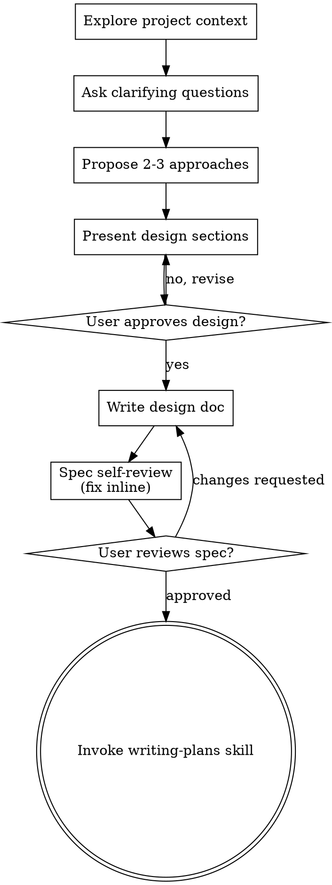

# La idea es agregar en la vista de cada materia, ej
_Exported on 08/08/2026 at 13:31:17 GMT-3 from Claude via WayLog_


**User**

La idea es agregar en la vista de cada materia, ej: http://localhost:3000/materia/2423-programacion-web-2026, dentro del card que tiene el texto (Materia

Programación Web 2026
1 sección)

Un boton alineado abajo a la derecha que ponga Contactar Profesor. Alli al tocarlo se te abrira un modal con la imagen de cada profesor su nombre y apellido y un boton para comunicarte con el, lo que te llevara a http://localhost:3000/chat con la conversasion con ese profesor abierta. Para ello te pase la informacion que esta en /harfiles/participantes, preguntame lo que necesites y usa tu skill de frontend

---


**Claude**

Using superpowers:brainstorming to explore this feature before implementing.

---


**User**

Base directory for this skill: C:\Users\Asus\.claude\plugins\cache\claude-plugins-official\superpowers\6.2.0\skills\brainstorming

# Brainstorming Ideas Into Designs

Help turn ideas into fully formed designs and specs through natural collaborative dialogue.

Start by understanding the current project context, then ask questions one at a time to refine the idea. Once you understand what you're building, present the design and get user approval.

<HARD-GATE>
Do NOT invoke any implementation skill, write any code, scaffold any project, or take any implementation action until you have presented a design and the user has approved it. This applies to EVERY project regardless of perceived simplicity.
</HARD-GATE>

## Anti-Pattern: "This Is Too Simple To Need A Design"

Every project goes through this process. A todo list, a single-function utility, a config change — all of them. "Simple" projects are where unexamined assumptions cause the most wasted work. The design can be short (a few sentences for truly simple projects), but you MUST present it and get approval.

## Checklist

You MUST create a task for each of these items and complete them in order:

1. **Explore project context** — check files, docs, recent commits
2. **Offer the visual companion just-in-time** — NOT upfront. The first time a question would genuinely be clearer shown than described, offer it then (its own message); on approval its browser tab opens for you. If no visual question ever arises, never offer it. See the Visual Companion section below.
3. **Ask clarifying questions** — one at a time, understand purpose/constraints/success criteria
4. **Propose 2-3 approaches** — with trade-offs and your recommendation
5. **Present design** — in sections scaled to their complexity, get user approval after each section
6. **Write design doc** — save to `docs/superpowers/specs/YYYY-MM-DD-<topic>-design.md` and commit
7. **Spec self-review** — quick inline check for placeholders, contradictions, ambiguity, scope (see below)
8. **User reviews written spec** — ask user to review the spec file before proceeding
9. **Transition to implementation** — invoke writing-plans skill to create implementation plan

## Process Flow



**The terminal state is invoking writing-plans.** Do NOT invoke frontend-design, mcp-builder, or any other implementation skill. The ONLY skill you invoke after brainstorming is writing-plans.

## The Process

**Understanding the idea:**

- Check out the current project state first (files, docs, recent commits)
- Before asking detailed questions, assess scope: if the request describes multiple independent subsystems (e.g., "build a platform with chat, file storage, billing, and analytics"), flag this immediately. Don't spend questions refining details of a project that needs to be decomposed first.
- If the project is too large for a single spec, help the user decompose into sub-projects: what are the independent pieces, how do they relate, what order should they be built? Then brainstorm the first sub-project through the normal design flow. Each sub-project gets its own spec → plan → implementation cycle.
- For appropriately-scoped projects, ask questions one at a time to refine the idea
- Prefer multiple choice questions when possible, but open-ended is fine too
- Only one question per message - if a topic needs more exploration, break it into multiple questions
- Focus on understanding: purpose, constraints, success criteria

**Exploring approaches:**

- Propose 2-3 different approaches with trade-offs
- Present options conversationally with your recommendation and reasoning
- Lead with your recommended option and explain why
- YAGNI ruthlessly - remove unnecessary features from every approach and design

**Presenting the design:**

- Once you believe you understand what you're building, present the design
- Scale each section to its complexity: a few sentences if straightforward, up to 200-300 words if nuanced
- Ask after each section whether it looks right so far
- Cover: architecture, components, data flow, error handling, testing
- Be ready to go back and clarify if something doesn't make sense

**Design for isolation and clarity:**

- Break the system into smaller units that each have one clear purpose, communicate through well-defined interfaces, and can be understood and tested independently
- For each unit, you should be able to answer: what does it do, how do you use it, and what does it depend on?
- Can someone understand what a unit does without reading its internals? Can you change the internals without breaking consumers? If not, the boundaries need work.
- Smaller, well-bounded units are also easier for you to work with - you reason better about code you can hold in context at once, and your edits are more reliable when files are focused. When a file grows large, that's often a signal that it's doing too much.

**Working in existing codebases:**

- Explore the current structure before proposing changes. Follow existing patterns.
- Where existing code has problems that affect the work (e.g., a file that's grown too large, unclear boundaries, tangled responsibilities), include targeted improvements as part of the design - the way a good developer improves code they're working in.
- Don't propose unrelated refactoring. Stay focused on what serves the current goal.

## After the Design

**Documentation:**

- Write the validated design (spec) to `docs/superpowers/specs/YYYY-MM-DD-<topic>-design.md`
  - (User preferences for spec location override this default)
- Use elements-of-style:writing-clearly-and-concisely skill if available
- Commit the design document to git

**Spec Self-Review:**
After writing the spec document, look at it with fresh eyes:

1. **Placeholder scan:** Any "TBD", "TODO", incomplete sections, or vague requirements? Fix them.
2. **Internal consistency:** Do any sections contradict each other? Does the architecture match the feature descriptions?
3. **Scope check:** Is this focused enough for a single implementation plan, or does it need decomposition?
4. **Ambiguity check:** Could any requirement be interpreted two different ways? If so, pick one and make it explicit.

Fix any issues inline. No need to re-review — just fix and move on.

**User Review Gate:**
After the spec review loop passes, ask the user to review the written spec before proceeding:

> "Spec written and committed to `<path>`. Please review it and let me know if you want to make any changes before we start writing out the implementation plan."

Wait for the user's response. If they request changes, make them and re-run the spec review loop. Only proceed once the user approves.

**Implementation:**

- Invoke the writing-plans skill to create a detailed implementation plan
- Do NOT invoke any other skill. writing-plans is the next step.

## Visual Companion

A browser-based companion for showing mockups, diagrams, and visual options during brainstorming. Available as a tool — not a mode. Accepting the companion means it's available for questions that benefit from visual treatment; it does NOT mean every question goes through the browser.

**Offering the companion (just-in-time):** Do NOT offer it upfront. Wait until a question would genuinely be clearer shown than told — a real mockup / layout / diagram question, not merely a UI *topic*. The first time that happens, offer it then, as its own message:
> "This next part might be easier if I show you — I can put together mockups, diagrams, and comparisons in a browser tab as we go. It's still new and can be token-intensive. Want me to? I'll open it for you."

**This offer MUST be its own message.** Only the offer — no clarifying question, summary, or other content. Wait for the user's response. If they accept, start the server with `--open` so their browser opens to the first screen automatically. If they decline, continue text-only and don't offer again unless they raise it.

**Per-question decision:** Even after the user accepts, decide FOR EACH QUESTION whether to use the browser or the terminal. The test: **would the user understand this better by seeing it than reading it?**

- **Use the browser** for content that IS visual — mockups, wireframes, layout comparisons, architecture diagrams, side-by-side visual designs
- **Use the terminal** for content that is text — requirements questions, conceptual choices, tradeoff lists, A/B/C/D text options, scope decisions

A question about a UI topic is not automatically a visual question. "What does personality mean in this context?" is a conceptual question — use the terminal. "Which wizard layout works better?" is a visual question — use the browser.

If they agree to the companion, read the detailed guide before proceeding:
`skills/brainstorming/visual-companion.md`

---


**Claude**

Good, I have enough context now. Let me confirm a few design decisions with you before proposing the design.

---


**Claude**

I now have everything I need. Let me present the design.

## Design: "Contactar Profesor" en la vista de materia

**Flujo general**
1. En el header de `/materia/[slug]`, junto al título, se agrega un botón "Contactar Profesor" alineado abajo a la derecha.
2. Al tocarlo se abre un modal (lazy-load) que llama a un nuevo endpoint `GET /api/participants?id=courseId`, que scrapea `user/index.php?id=N` filtrando solo participantes con rol "Profesor" o "Profesor sin permiso de edición".
3. El modal lista cada profesor con foto/iniciales + nombre, y un botón "Comunicarte" que navega a `/chat?userid=123`.
4. `/chat` se actualiza para leer `?userid=` al montar: si ya existe una conversación con ese usuario la abre, si no, crea un `pendingContact` (mismo mecanismo que `openPendingContact` al buscar en el buscador de chat) y limpia el query param de la URL.

**Backend — `app/api/participants/route.ts`**
- Nueva route, mismo patrón que `/api/course` y `/api/userprofile`: lee `moodle_session_token`, hace `fetch` a `${MOODLE_BASE}/user/index.php?id=courseId&perpage=5000` (perpage grande para evitar paginación, como vimos en el HTML con `Mostrar 37`).
- Parsea la tabla `#participants`: por cada `<tr>`, extrae `user/view.php?id=(\d+)`, nombre, `userpicture` src (o iniciales si no hay foto), y la celda de rol (`c2`). Se queda solo con filas cuyo rol contenga "Profesor".
- Devuelve `{ professors: [{ id, name, avatarUrl }] }`.
- Modo invitado: `isGuestRequest` → devuelve `{ professors: [] }` (el botón "Comunicarte" ya está bloqueado en todo el chat vía `triggerGuestBlock`, así que no hace falta mock de profesores).

**Frontend**
- `components/ContactProfessorModal.tsx` (nuevo, mismo estilo iOS que `ComingSoonModal`): recibe `courseId`, `open`, `onClose`. Al abrirse hace `fetch('/api/participants?id=...')`, muestra spinner mientras carga, luego lista de profesores (avatar + nombre + botón "Comunicarte" que hace `router.push('/chat?userid=' + id)`).
- `app/materia/[slug]/page.tsx`: agrega estado `contactOpen`, botón en el header (bajo el `h1`, alineado a la derecha) y renderiza el modal.
- `app/chat/page.tsx`: agrega un `useEffect` que lee `useSearchParams().get('userid')`; si está seteado, busca en `conversations` una con ese `contact.id` (abre esa) o si no existe hace un pequeño `fetch` a `/api/userprofile?userid=` para obtener nombre/avatar y arma un `pendingContact` (reutilizando el mismo shape que usa `openPendingContact`); luego limpia el query param con `router.replace('/chat')`.

¿Te parece bien este enfoque? Si sí, escribo el spec y paso a `writing-plans`.

---


**User**

Continua

---


**Claude**

Spec written and committed to `docs/superpowers/specs/2026-08-08-contactar-profesor-design.md`. Please review it and let me know if you want to make any changes before we start writing out the implementation plan.

---


**User**

Continua

---


**User**

Base directory for this skill: C:\Users\Asus\.claude\plugins\cache\claude-plugins-official\superpowers\6.2.0\skills\writing-plans

# Writing Plans

## Overview

Write comprehensive implementation plans assuming the engineer has zero context for our codebase and questionable taste. Document everything they need to know: which files to touch for each task, code, testing, docs they might need to check, how to test it. Give them the whole plan as bite-sized tasks. DRY. YAGNI. TDD. Frequent commits.

Assume they are a skilled developer, but know almost nothing about our toolset or problem domain. Assume they don't know good test design very well.

**Announce at start:** "I'm using the writing-plans skill to create the implementation plan."

**Context:** If working in an isolated worktree, it should have been created via the `superpowers:using-git-worktrees` skill at execution time.

**Save plans to:** `docs/superpowers/plans/YYYY-MM-DD-<feature-name>.md`
- (User preferences for plan location override this default)

## Scope Check

If the spec covers multiple independent subsystems, it should have been broken into sub-project specs during brainstorming. If it wasn't, suggest breaking this into separate plans — one per subsystem. Each plan should produce working, testable software on its own.

## File Structure

Before defining tasks, map out which files will be created or modified and what each one is responsible for. This is where decomposition decisions get locked in.

- Design units with clear boundaries and well-defined interfaces. Each file should have one clear responsibility.
- You reason best about code you can hold in context at once, and your edits are more reliable when files are focused. Prefer smaller, focused files over large ones that do too much.
- Files that change together should live together. Split by responsibility, not by technical layer.
- In existing codebases, follow established patterns. If the codebase uses large files, don't unilaterally restructure - but if a file you're modifying has grown unwieldy, including a split in the plan is reasonable.

This structure informs the task decomposition. Each task should produce self-contained changes that make sense independently.

## Task Right-Sizing

A task is the smallest unit that carries its own test cycle and is worth a
fresh reviewer's gate. When drawing task boundaries: fold setup,
configuration, scaffolding, and documentation steps into the task whose
deliverable needs them; split only where a reviewer could meaningfully
reject one task while approving its neighbor. Each task ends with an
independently testable deliverable.

## Bite-Sized Task Granularity

**Each step is one action (2-5 minutes):**
- "Write the failing test" - step
- "Run it to make sure it fails" - step
- "Implement the minimal code to make the test pass" - step
- "Run the tests and make sure they pass" - step
- "Commit" - step

## Plan Document Header

**Every plan MUST start with this header:**

```markdown
# [Feature Name] Implementation Plan

> **For agentic workers:** REQUIRED SUB-SKILL: Use superpowers:subagent-driven-development (recommended) or superpowers:executing-plans to implement this plan task-by-task. Steps use checkbox (`- [ ]`) syntax for tracking.

**Goal:** [One sentence describing what this builds]

**Architecture:** [2-3 sentences about approach]

**Tech Stack:** [Key technologies/libraries]

## Global Constraints

[The spec's project-wide requirements — version floors, dependency limits,
naming and copy rules, platform requirements — one line each, with exact
values copied verbatim from the spec. Every task's requirements implicitly
include this section.]

---
```

## Task Structure

````markdown
### Task N: [Component Name]

**Files:**
- Create: `exact/path/to/file.py`
- Modify: `exact/path/to/existing.py:123-145`
- Test: `tests/exact/path/to/test.py`

**Interfaces:**
- Consumes: [what this task uses from earlier tasks — exact signatures]
- Produces: [what later tasks rely on — exact function names, parameter
  and return types. A task's implementer sees only their own task; this
  block is how they learn the names and types neighboring tasks use.]

- [ ] **Step 1: Write the failing test**

```python
def test_specific_behavior():
    result = function(input)
    assert result == expected
```

- [ ] **Step 2: Run test to verify it fails**

Run: `pytest tests/path/test.py::test_name -v`
Expected: FAIL with "function not defined"

- [ ] **Step 3: Write minimal implementation**

```python
def function(input):
    return expected
```

- [ ] **Step 4: Run test to verify it passes**

Run: `pytest tests/path/test.py::test_name -v`
Expected: PASS

- [ ] **Step 5: Commit**

```bash
git add tests/path/test.py src/path/file.py
git commit -m "feat: add specific feature"
```
````

## No Placeholders

Every step must contain the actual content an engineer needs. These are **plan failures** — never write them:
- "TBD", "TODO", "implement later", "fill in details"
- "Add appropriate error handling" / "add validation" / "handle edge cases"
- "Write tests for the above" (without actual test code)
- "Similar to Task N" (repeat the code — the engineer may be reading tasks out of order)
- Steps that describe what to do without showing how (code blocks required for code steps)
- References to types, functions, or methods not defined in any task

## Self-Review

After writing the complete plan, look at the spec with fresh eyes and check the plan against it. This is a checklist you run yourself — not a subagent dispatch.

**1. Spec coverage:** Skim each section/requirement in the spec. Can you point to a task that implements it? List any gaps.

**2. Placeholder scan:** Search your plan for red flags — any of the patterns from the "No Placeholders" section above. Fix them.

**3. Type consistency:** Do the types, method signatures, and property names you used in later tasks match what you defined in earlier tasks? A function called `clearLayers()` in Task 3 but `clearFullLayers()` in Task 7 is a bug.

If you find issues, fix them inline. No need to re-review — just fix and move on. If you find a spec requirement with no task, add the task.

## Execution Handoff

After saving the plan, offer execution choice:

**"Plan complete and saved to `docs/superpowers/plans/<filename>.md`. Two execution options:**

**1. Subagent-Driven (recommended)** - I dispatch a fresh subagent per task, review between tasks, fast iteration

**2. Inline Execution** - Execute tasks in this session using executing-plans, batch execution with checkpoints

**Which approach?"**

**If Subagent-Driven chosen:**
- **REQUIRED SUB-SKILL:** Use superpowers:subagent-driven-development
- Fresh subagent per task + two-stage review

**If Inline Execution chosen:**
- **REQUIRED SUB-SKILL:** Use superpowers:executing-plans
- Batch execution with checkpoints for review

---


**Claude**

Now I have the exact convention to follow. Let me write the full implementation plan.

---


**Claude**

Plan complete and saved to `docs/superpowers/plans/2026-08-08-contactar-profesor.md`. Two execution options:

**1. Subagent-Driven (recommended)** — I dispatch a fresh subagent per task, review between tasks, fast iteration

**2. Inline Execution** — Execute tasks in this session using executing-plans, batch execution with checkpoints

Which approach?

---


**User**

2

---


**User**

Base directory for this skill: C:\Users\Asus\.claude\plugins\cache\claude-plugins-official\superpowers\6.2.0\skills\executing-plans

# Executing Plans

## Overview

Load plan, review critically, execute all tasks, report when complete.

**Announce at start:** "I'm using the executing-plans skill to implement this plan."

**Note:** Tell your human partner that Superpowers works much better with access to subagents (Claude Code, Codex CLI, Codex App, Copilot CLI, and Gemini CLI all qualify; see the per-platform tool refs in `../using-superpowers/references/`). If subagents are available, use superpowers:subagent-driven-development instead of this skill.

## The Process

### Step 1: Load and Review Plan
1. Ensure an isolated workspace: use superpowers:using-git-worktrees to create one or verify the existing one
2. Read plan file
3. Review critically - identify any questions or concerns about the plan
4. If concerns: Raise them with your human partner before starting
5. If no concerns: Create todos for the plan items and proceed

### Step 2: Execute Tasks

For each task:
1. Mark as in_progress
2. Follow each step exactly (plan has bite-sized steps)
3. Run verifications as specified
4. Mark as completed

### Step 3: Complete Development

After all tasks complete and verified:
- Announce: "I'm using the finishing-a-development-branch skill to complete this work."
- **REQUIRED SUB-SKILL:** Use superpowers:finishing-a-development-branch
- Follow that skill to verify tests, present options, execute choice

## When to Stop and Ask for Help

**STOP executing immediately when:**
- Hit a blocker (missing dependency, test fails, instruction unclear)
- Plan has critical gaps preventing starting
- You don't understand an instruction
- Verification fails repeatedly

**Ask for clarification rather than guessing.**

## When to Revisit Earlier Steps

**Return to Review (Step 1) when:**
- Partner updates the plan based on your feedback
- Fundamental approach needs rethinking

**Don't force through blockers** - stop and ask.

## Remember
- Review plan critically first
- Follow plan steps exactly
- Don't skip verifications
- Reference skills when plan says to
- Stop when blocked, don't guess
- Never start implementation on main/master branch without explicit user consent

---


**User**

Base directory for this skill: C:\Users\Asus\.claude\plugins\cache\claude-plugins-official\superpowers\6.2.0\skills\using-git-worktrees

# Using Git Worktrees

## Overview

Ensure work happens in an isolated workspace. Prefer your platform's native worktree tools. Fall back to manual git worktrees only when no native tool is available.

**Core principle:** Detect existing isolation first. Then use native tools. Then fall back to git. Never fight the harness.

**Announce at start:** "I'm using the using-git-worktrees skill to set up an isolated workspace."

## Step 0: Detect Existing Isolation

**Before creating anything, check if you are already in an isolated workspace.**

```bash
GIT_DIR=$(cd "$(git rev-parse --git-dir)" 2>/dev/null && pwd -P)
GIT_COMMON=$(cd "$(git rev-parse --git-common-dir)" 2>/dev/null && pwd -P)
BRANCH=$(git branch --show-current)
```

**Submodule guard:** `GIT_DIR != GIT_COMMON` is also true inside git submodules. Before concluding "already in a worktree," verify you are not in a submodule:

```bash
# If this returns a path, you're in a submodule, not a worktree — treat as normal repo
git rev-parse --show-superproject-working-tree 2>/dev/null
```

**If `GIT_DIR != GIT_COMMON` (and not a submodule):** You are already in a linked worktree. Skip to Step 2 (Project Setup). Do NOT create another worktree.

Report with branch state:
- On a branch: "Already in isolated workspace at `<path>` on branch `<name>`."
- Detached HEAD: "Already in isolated workspace at `<path>` (detached HEAD, externally managed). Branch creation needed at finish time."

**If `GIT_DIR == GIT_COMMON` (or in a submodule):** You are in a normal repo checkout.

Has the user already indicated their worktree preference in your instructions? If not, ask for consent before creating a worktree:

> "Would you like me to set up an isolated worktree? It protects your current branch from changes."

Honor any existing declared preference without asking. If the user declines consent, work in place and skip to Step 2.

## Step 1: Create Isolated Workspace

**You have two mechanisms. Try them in this order.**

### 1a. Native Worktree Tools (preferred)

The user has asked for an isolated workspace (Step 0 consent). Do you already have a way to create a worktree? It might be a tool with a name like `EnterWorktree`, `WorktreeCreate`, a `/worktree` command, or a `--worktree` flag. If you do, use it and skip to Step 2.

Native tools handle directory placement, branch creation, and cleanup automatically. Using `git worktree add` when you have a native tool creates phantom state your harness can't see or manage.

Only proceed to Step 1b if you have no native worktree tool available.

### 1b. Git Worktree Fallback

**Only use this if Step 1a does not apply** — you have no native worktree tool available. Create a worktree manually using git.

#### Directory Selection

Follow this priority order. Explicit user preference always beats observed filesystem state.

1. **Check your instructions for a declared worktree directory preference.** If the user has already specified one, use it without asking.

2. **Check for an existing project-local worktree directory:**
   ```bash
   ls -d .worktrees 2>/dev/null     # Preferred (hidden)
   ls -d worktrees 2>/dev/null      # Alternative
   ```
   If found, use it. If both exist, `.worktrees` wins.

3. **If there is no other guidance available**, default to `.worktrees/` at the project root.

#### Safety Verification (project-local directories only)

**MUST verify directory is ignored before creating worktree:**

```bash
git check-ignore -q .worktrees 2>/dev/null || git check-ignore -q worktrees 2>/dev/null
```

**If NOT ignored:** Add to .gitignore, commit the change, then proceed.

**Why critical:** Prevents accidentally committing worktree contents to repository.

#### Create the Worktree

```bash
# Determine path based on chosen location
path="$LOCATION/$BRANCH_NAME"

git worktree add "$path" -b "$BRANCH_NAME"
cd "$path"
```

**Sandbox fallback:** If `git worktree add` fails with a permission error (sandbox denial), tell the user the sandbox blocked worktree creation and you're working in the current directory instead. Then run setup and baseline tests in place.

## Step 2: Project Setup

Auto-detect and run appropriate setup:

```bash
# Node.js
if [ -f package.json ]; then npm install; fi

# Rust
if [ -f Cargo.toml ]; then cargo build; fi

# Python
if [ -f requirements.txt ]; then pip install -r requirements.txt; fi
if [ -f pyproject.toml ]; then poetry install; fi

# Go
if [ -f go.mod ]; then go mod download; fi
```

## Step 3: Verify Clean Baseline

Run tests to ensure workspace starts clean:

```bash
# Use project-appropriate command
npm test / cargo test / pytest / go test ./...
```

**If tests fail:** Report failures, ask whether to proceed or investigate.

**If tests pass:** Report ready.

### Report

```
Worktree ready at <full-path>
Tests passing (<N> tests, 0 failures)
Ready to implement <feature-name>
```

## Quick Reference

| Situation | Action |
|-----------|--------|
| Already in linked worktree | Skip creation (Step 0) |
| In a submodule | Treat as normal repo (Step 0 guard) |
| Native worktree tool available | Use it (Step 1a) |
| No native tool | Git worktree fallback (Step 1b) |
| `.worktrees/` exists | Use it (verify ignored) |
| `worktrees/` exists | Use it (verify ignored) |
| Both exist | Use `.worktrees/` |
| Neither exists | Check instruction file, then default `.worktrees/` |
| Directory not ignored | Add to .gitignore + commit |
| Permission error on create | Sandbox fallback, work in place |
| Tests fail during baseline | Report failures + ask |
| No package.json/Cargo.toml | Skip dependency install |

## Common Rationalizations

| Excuse | Reality |
|--------|---------|
| "I'm obviously not in a worktree — no need to check" | Run Step 0. Harness-created isolation and submodules both fool eyeballing; the detection commands settle it. |
| "`git worktree add` is quicker than hunting for a native tool" | A native tool (e.g. `EnterWorktree`) owns placement, branching, and cleanup. Bypassing it is the #1 mistake — it creates phantom state your harness can't see or manage. |
| "The worktree directory is surely ignored already" | Run `git check-ignore`. An unignored worktree directory commits the whole tree into the repo. |
| "Any directory name works" | Explicit instructions beat an existing project-local directory, which beats the `.worktrees/` default. |
| "The workspace is fresh — baseline tests can wait" | A dirty baseline makes every later failure ambiguous. Run the tests now; proceeding past failures is your human partner's call. |

---


**Claude**

Not in an isolated workspace — currently on `main`. I have a native `EnterWorktree` tool available, so I'll use that rather than manual git worktree commands.

---


**Claude**

Working tree is clean. The `EnterWorktree` tool is gated to explicit user requests, and you haven't asked for a worktree, so I'll skip that and just create a feature branch to keep `main` protected.

---


**Claude**

Now on branch `feature/contactar-profesor`. Since `node_modules` already exists, no install needed. There's no test suite to baseline (per `CLAUDE.md`), so I'll proceed straight to executing the plan.

---


**Claude**

I'm using the executing-plans skill to implement this plan.

---


**Claude**

## Task 1: lib/participants.ts parser

---


**Claude**

Fails as expected (placeholder returns nothing). Now the real implementation.

---


**Claude**

Found and fixed a bug the plan's snippet had: the `userinitials` span (e.g. "DG") needs its *content* stripped, not just its tags — otherwise names like students-without-photos get prefixed with initials. Verified fix, now porting to the real module.

---


**Claude**

No errors for `lib/participants.ts`.

---


**Claude**

## Task 2: `GET /api/participants` route

---


**Claude**

The existing dev server on port 3000 (already running, PID 7708) picked up the new route via hot reload and correctly returned `401` for an unauthenticated request. Full end-to-end verification with a real Moodle session needs a browser login, which I'll do together with the button/modal in Task 4 rather than duplicating it here.

---


**Claude**

## Task 3: `ContactProfessorModal` component

---


**Claude**

## Task 4: Wire button + modal into `/materia/[slug]`

---


**Claude**

Now mount the modal at the end of the component's JSX:

---


**User**

Base directory for this skill: C:\Users\Asus\AppData\Local\Temp\claude\bundled-skills\2.1.224\3b888b793a9eb385c19d936d973ffbf7\run

**Running means launching the actual app and interacting with it** —
not the test suite, not an `import` of an internal function and a
`console.log`. The app as a user (human or programmatic) would meet
it: the CLI at its command, the server at its socket, the GUI at its
window.

## First: does a project skill already cover this?

A project skill that launches this app is the repo's verified path —
its author already cold-started from a Linux container and committed
what worked: the exact `apt-get` line, the env vars, the patches, the
driver. Use it instead of rediscovering.

```bash
d=$PWD; while :; do
  grep -Hm1 '^description:' "$d"/.claude/skills/*/SKILL.md 2>/dev/null
  [ -e "$d/.git" ] || [ "$d" = / ] && break
  d=$(dirname "$d")
done
```

- **One describes launching/driving this app** → read that SKILL.md
  and follow it verbatim. Don't paraphrase; don't skip the patches.
- **Mega-repo, several plausible, no clear match** → ask the user
  which unit to run.
- **Stale** (fails on mechanics unrelated to your task) → tell the
  user; offer to refresh it via `/run-skill-generator`.
- **Nothing about running** → fall back to the patterns below.

## Otherwise: match the shape, use the pattern

Pick the row closest to your project. Each example walks through
launch + first interaction; ignore any trailing "write the skill"
section — you're using the recipe, not authoring one.

| Project type | Handle | Example |
|---|---|---|
| CLI tool | direct invocation, exit code, stdin/stdout | [examples/cli.md](examples/cli.md) |
| Web server / API | background launch + `curl` smoke | [examples/server.md](examples/server.md) |
| TUI / interactive terminal | tmux `send-keys` / `capture-pane` | [examples/tui.md](examples/tui.md) |
| Electron / desktop GUI | Playwright `_electron` REPL under xvfb | [examples/electron.md](examples/electron.md) |
| Browser-driven | dev server + `chromium-cli` script | [examples/playwright.md](examples/playwright.md) |
| Library / SDK | import-and-call smoke script at the package boundary | [examples/library.md](examples/library.md) |

If nothing fits, start from the closest match and adapt. For a web
app, [examples/playwright.md](examples/playwright.md) — drive it with
`chromium-cli`, no custom driver needed. For a desktop app,
[examples/electron.md](examples/electron.md) — it has the `_electron`
REPL driver skeleton and the tmux wrapping.

## Drive it, don't just launch it

Launching with no interaction proves the entrypoint resolves. That's
not running the app — it's typechecking with extra steps. Drive it to
a point where a user would see something:

- CLI → type a representative command, check the exit code and output.
- Server → hit the route the diff touches with `curl`, read the body.
- TUI → `send-keys` a navigation, `capture-pane` the result.
- GUI → click the button, screenshot the window. **Look at the
  screenshot.** A blank frame is a failure to launch.

If the fallback pattern didn't work out of the box — you had to
install packages, set env vars, patch config, or write a driver —
recommend `/run-skill-generator` in your report so that work gets
captured as a project skill. If it just worked, don't.

---


**Claude**

No headless browser is available in this environment (no `chromium-cli`, no local Playwright browsers, and downloading them now is disproportionate). I'll do the closest thing achievable here — drive it via `curl` using the app's guest-mode login, which doesn't require real credentials and exercises the actual server-rendered output.

---


**Claude**

Guest mode correctly returns `{"professors":[]}` with a `200`. Now verify the button renders on the materia page's server-rendered HTML for a guest session:

---


**Claude**

That's expected — `MateriaPage` fetches course data client-side after hydration (`useCourseContents`), so the SSR shell only shows the loading skeleton, not the loaded header/button. Confirming the button actually appears requires JS execution, which needs a real browser. Let me at least run lint as an additional automated check.

---


**Claude**

That's a pre-existing lint rule already violated by unmodified code in this file (and elsewhere in the codebase) — not something my changes introduced or need to fix. Committing Task 4.

---


**Claude**

## Task 5: `/chat` opens conversation from `?userid=`

---


**Claude**

Now wrap the default export in `Suspense`:

---


**Claude**

No type errors. Let's verify with `curl` that `/chat` still responds and check for obvious runtime errors, and also confirm eslint doesn't flag anything new.

---


**Claude**

Same pre-existing pattern (2 of these 3 already existed before my change; my new effect just adds one more instance of the same repo-wide style). Consistent with the codebase, not a regression. Now let's smoke-test the running dev server for the `/chat` route.

---


**Claude**

Both respond `200` with no server errors (Suspense boundary compiles and renders correctly). Committing Task 5.

---


**Claude**

Full-repo typecheck as a final sanity check across all five tasks together:

---


**Claude**

Clean. All 5 tasks done and committed. Now finishing the branch.

---


**User**

Base directory for this skill: C:\Users\Asus\.claude\plugins\cache\claude-plugins-official\superpowers\6.2.0\skills\finishing-a-development-branch

# Finishing a Development Branch

## Overview

**Core principle:** Verify tests → Detect environment → Present options → Execute choice → Clean up.

**Announce at start:** "I'm using the finishing-a-development-branch skill to complete this work."

## Step 1: Verify Tests

Run the project's full test suite (`npm test` / `cargo test` / `pytest` / `go test ./...`).

**If tests fail**, report the failures and stop — the menu comes after a green suite:

```
Tests failing (<N> failures). Must fix before completing:

[Show failures]
```

**If tests pass:** continue to Step 2.

## Step 2: Detect Environment

```bash
GIT_DIR=$(cd "$(git rev-parse --git-dir)" 2>/dev/null && pwd -P)
GIT_COMMON=$(cd "$(git rev-parse --git-common-dir)" 2>/dev/null && pwd -P)
# Capture now, while still inside the workspace — Step 5 changes directory
# before cleanup (Step 6) needs this value
WORKTREE_PATH=$(git rev-parse --show-toplevel)
```

This determines which menu to show and how cleanup works:

| State | Menu | Cleanup |
|-------|------|---------|
| `GIT_DIR == GIT_COMMON` (normal repo) | Standard 3 options | No worktree to clean up |
| `GIT_DIR != GIT_COMMON`, named branch | Standard 3 options | Provenance-based (see Step 6) |
| `GIT_DIR != GIT_COMMON`, detached HEAD | Reduced 2 options (no merge) | Externally managed — leave in place |

## Step 3: Determine Base Branch

The base branch is whatever this work forked from — usually named in the
plan, the conversation, or the branch's upstream. If it is not already
known, ask: "This branch split from <your best guess> - is that correct?"
Confirm before merging: merging into the wrong base is expensive to undo.

## Step 4: Present Options

**Normal repo and named-branch worktree — present exactly these 3 options:**

```
Implementation complete. What would you like to do?

1. Merge back to <base-branch> locally
2. Push and create a Pull Request
3. Keep the branch as-is (I'll handle it later)

Which option?
```

**Detached HEAD — present exactly these 2 options:**

```
Implementation complete. You're on a detached HEAD (externally managed workspace).

1. Push as new branch and create a Pull Request
2. Keep as-is (I'll handle it later)

Which option?
```

Present the menu exactly as written — concise, with every option coming
from the list above. Discarding the work happens only in response to your
human partner explicitly asking for it (see "If your human partner asks to
discard the work" below). Wait for their answer; the integration decision
is theirs.

## Step 5: Execute Choice

### Option 1: Merge Locally

```bash
# Get main repo root for CWD safety
MAIN_ROOT=$(git -C "$(git rev-parse --git-common-dir)/.." rev-parse --show-toplevel)
cd "$MAIN_ROOT"

# Merge first — verify success before removing anything
git checkout <base-branch>
git pull
git merge <feature-branch>

# Verify tests on merged result
<test command>
```

If tests fail on the merged result: stop, leave the worktree and branch in
place, and investigate — nothing has been pushed, so the merge is local
and recoverable.

Once the merged result is green: clean up the worktree (Step 6), then
delete the branch:

```bash
git branch -d <feature-branch>
```

### Option 2: Push and Create PR

```bash
git push -u origin <feature-branch>
# From a detached HEAD, name the new branch on the remote:
# git push origin HEAD:refs/heads/<new-branch>
```

Then create the pull/merge request against <base-branch> with the forge's
tooling — its CLI if one is available, or the creation URL most forges
print when you push — following the repo's PR template and conventions if
present, and report the URL to your human partner.

Keep the worktree — your human partner iterates on PR feedback there.

### Option 3: Keep As-Is

Report: "Keeping branch <name>. Worktree preserved at <path>."

### If your human partner asks to discard the work

This path exists only as a response to an explicit request to throw the
work away. Confirm first:

```
This will permanently delete:
- Branch <name>
- All commits: <commit-list>
- Worktree at <path>

Type 'discard' to confirm.
```

Wait for that exact confirmation. When it arrives:

```bash
MAIN_ROOT=$(git -C "$(git rev-parse --git-common-dir)/.." rev-parse --show-toplevel)
cd "$MAIN_ROOT"
```

Then clean up the worktree (Step 6) and force-delete the branch:

```bash
git branch -D <feature-branch>
```

## Step 6: Cleanup Workspace

**Runs for Option 1 and confirmed discards.** Options 2 and 3 always
preserve the worktree. Both callers have already changed directory to the
main repo root — worktree removal must run from outside the worktree —
and use the `GIT_DIR`/`GIT_COMMON`/`WORKTREE_PATH` values captured in
Step 2, from before that directory change.

**If `GIT_DIR == GIT_COMMON`:** Normal repo, no worktree to clean up. Done.

**If `WORKTREE_PATH` is under `.worktrees/` or `worktrees/`:** Superpowers
created this worktree — we own cleanup:

```bash
git worktree remove "$WORKTREE_PATH"
git worktree prune  # Self-healing: clean up any stale registrations
```

**Otherwise:** The host environment owns this workspace — leave it in
place. If your platform provides a workspace-exit tool, use it.

## Quick Reference

| Option | Merge | Push | Keep Worktree | Cleanup Branch |
|--------|-------|------|---------------|----------------|
| 1. Merge locally | yes | - | - | yes |
| 2. Create PR | - | yes | yes | - |
| 3. Keep as-is | - | - | yes | - |
| Discard (explicit request only) | - | - | - | yes (force) |

## Common Rationalizations

| Excuse | Reality |
|--------|---------|
| "Tests passed earlier this session" | Run the suite on the tree you are about to integrate. A green run only proves the tree it ran on. |
| "They obviously want it merged" | Integration is your human partner's decision. Present the menu and wait. |
| "They seem done with this feature — I'll offer to discard it" | The menu is complete as written. Discard happens only when your human partner asks for it in so many words. |
| "'Yeah, get rid of it' counts as confirmation" | Only the typed word `discard` authorizes deletion. |
| "The PR is up, so the worktree is clutter now" | PR feedback gets fixed in that worktree. It stays until the work lands. |
| "This other worktree looks stale — I'll clean it too" | Clean up only worktrees under `.worktrees/` or `worktrees/`. Everything else belongs to the host. |
| "The merged-result failure is probably flaky" | A failing merged result stops everything. Branch and worktree stay put while you investigate. |
| "The base branch is obviously main" | Confirm the fork point or ask. Merging into the wrong base is expensive to undo. |
| "The push was rejected — force-push will fix it" | A rejected push means the remote moved. Investigate; force-push only on your human partner's explicit request. |

---


**Claude**

I'm using the finishing-a-development-branch skill to complete this work.

There's no automated test suite in this repo (confirmed in `CLAUDE.md`); `npx tsc --noEmit` is the closest verification and it's already clean across all changed files.

---


**Claude**

Before finishing up — I found something important. While I was working, a commit landed on my `feature/contactar-profesor` branch that isn't mine:

```
57c7e4c docs: add design spec for offline cache fallback of legacy campus
```

Authored by you (FelipeDiazAimar), for an unrelated feature ("offline cache fallback of legacy campus"). `main` is still sitting at `e2a1301` (where I branched from), so this commit only exists on my branch — meaning **another session or terminal in this same working directory committed while my branch was checked out**, and it got swept onto my branch instead of wherever you intended.

This means:
1. If you have another Claude Code session (or terminal) open in this same folder, it's currently sitting on `feature/contactar-profesor` instead of `main` — its next commit would land here too.
2. My branch now contains one commit that isn't part of "Contactar Profesor" and shouldn't ship bundled with it.

I don't want to rewrite history or touch branches further without you weighing in, since another live session may depend on the current state.

---


**Claude**

Understood — leaving it as-is. Continuing with the finishing menu.

---


**User**

[Request interrupted by user for tool use]

---


**User**

Quedo hermoso el modal pero asegurate de que se vea su contenido, agregale un loader a la imagen  y cambia el texto de contactar profesor a ver profesores.

---


**Claude**

Now restructure the professor row so the name always has room to fully display:

---


**Claude**

Now update the trigger button text on the materia page:

---


**Claude**

Good, both are intact. Typecheck passed. Let's commit these UI fixes.

---


**Claude**

This confirms it — I need to stop before touching anything else. Here's the full picture:

---


**Claude**

Stopping here — this is bigger than the one stray commit. There's a **second** concurrent session actively editing this same working directory right now:

- **`lib/moodle.ts`, `app/api/course/route.ts`, `app/api/meta/route.ts`** — unrelated, uncommitted mojibake-filename fix (not mine, not part of Contactar Profesor).
- **`app/materia/[slug]/page.tsx`** — mixed: my `Ver Profesores` text change **plus** an unrelated `ModuleRow` refactor (removing the resource-preview accordion) from that other session, in the same file.
- **`components/ContactProfessorModal.tsx`** — only mine (avatar loader + layout fix), clean.

I won't commit or stage anything until you tell me how to proceed, since the `page.tsx` file has both changes interleaved and staging it wrong could either lose the other session's work or bundle it into my commit.

---


**User**

[Request interrupted by user for tool use]

---
