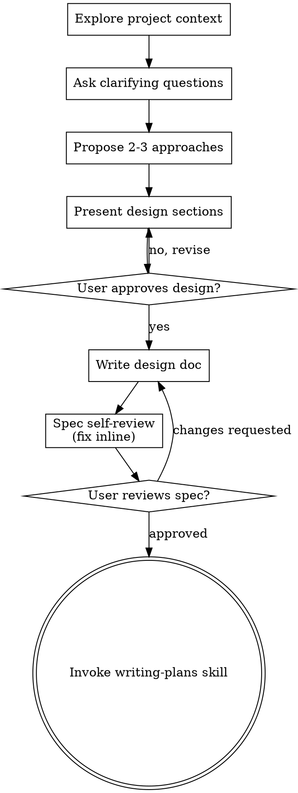

# Averigua opciones como ocr ya que para los archivo
_Exported on 08/08/2026 at 13:31:17 GMT-3 from Claude via WayLog_


**User**

Averigua opciones como ocr ya que para los archivos que traen las materias no puedo seleccionar el texto en la previsualicacion, quiero poder hacer eso pero debemos de tener alguna herramienta propia, busca en internet si hay algo que podamos usar.

---


**Claude**

Antes de buscar, encontré algo importante en el código: la selección de texto en los PDFs no está deshabilitada por falta de OCR — [components/CampusPDFViewer.tsx:69-73](components/CampusPDFViewer.tsx#L69-L73) muestra que `renderTextLayer` está apagado a propósito porque react-pdf tira un crash en algunos PDFs. O sea, probablemente los PDFs de Moodle ya tienen texto real embebido; el problema es un bug en el render de la capa de texto, no que sean escaneos-imagen. Voy a buscar igual opciones de OCR por si hay PDFs que sí son escaneos, y también la causa del crash del text layer.

---


**Claude**

## Lo que encontré

Antes de ir a buscar OCR, miré [components/CampusPDFViewer.tsx:69-73](components/CampusPDFViewer.tsx#L69-L73) y hay un comentario clave: la capa de texto de `react-pdf` está **apagada a propósito** (`renderTextLayer={false}`) porque en algunos PDFs de Moodle causaba un crash (`Cannot read properties of null (reading 'childNodes')`) que dejaba el visor en blanco. Es decir: la mayoría de esos PDFs probablemente **ya tienen texto real embebido** (son documentos exportados desde Word/PowerPoint por los profesores), y lo que falta no es reconocer texto sino renderizar la capa de texto ya existente sin que crashee.

Esto importa porque **OCR es la herramienta equivocada si el texto ya existe en el PDF** — es mucho más pesado (descarga modelos WASM de varios MB, tarda segundos por página) y menos preciso que usar el texto real. OCR solo tiene sentido para PDFs que son imágenes escaneadas puras (por ejemplo, apuntes fotografiados por un profesor, sin texto embebido).

## Opciones que investigué

**1. Arreglar la capa de texto nativa (react-pdf / pdf.js)** — el crash de `childNodes` es un bug conocido y recurrente en `react-pdf` al desmontar/remontar páginas mientras el text layer sigue renderizando async (relacionado a los issues [#1655](https://github.com/wojtekmaj/react-pdf/issues/1655) y similares en el repo). Se puede mitigar con `renderTextLayer={true}` + evitar el remount agresivo que ya hace el componente (el `fileKey` que fuerza remount completo), o envolver el layer en un error boundary por página en vez de crashear todo el visor.

**2. Tesseract.js** — para los PDFs que sí son escaneos-imagen. Es la librería estándar (WASM, 100% cliente o server-side en Node, gratis, sin límites de API). Flujo típico: `pdf.js` renderiza cada página a canvas → `tesseract.js` extrae el texto → se superpone como capa invisible seleccionable (igual que hace un PDF con OCR real). v6 (2026) mejoró memoria y performance. Fuentes: [Transloadit — OCR en browser con tesseract.js](https://transloadit.com/devtips/integrating-ocr-in-the-browser-with-tesseract-js/), [Dynamsoft — Web OCR tutorial](https://www.dynamsoft.com/codepool/free-web-ocr-image-pdf.html), [Medium — OCR con Node.js, pdf.js y Tesseract.js](https://medium.com/@rjaloudi/building-an-ocr-application-with-node-js-pdf-js-and-tesseract-js-c54fbd039173).

---


**User**

Base directory for this skill: C:\Users\Asus\.claude\plugins\cache\claude-plugins-official\superpowers\6.2.0\skills\brainstorming

# Brainstorming Ideas Into Designs

Help turn ideas into fully formed designs and specs through natural collaborative dialogue.

Start by understanding the current project context, then ask questions one at a time to refine the idea. Once you understand what you're building, present the design and get user approval.

<HARD-GATE>
Do NOT invoke any implementation skill, write any code, scaffold any project, or take any implementation action until you have presented a design and the user has approved it. This applies to EVERY project regardless of perceived simplicity.
</HARD-GATE>

## Anti-Pattern: "This Is Too Simple To Need A Design"

Every project goes through this process. A todo list, a single-function utility, a config change — all of them. "Simple" projects are where unexamined assumptions cause the most wasted work. The design can be short (a few sentences for truly simple projects), but you MUST present it and get approval.

## Checklist

You MUST create a task for each of these items and complete them in order:

1. **Explore project context** — check files, docs, recent commits
2. **Offer the visual companion just-in-time** — NOT upfront. The first time a question would genuinely be clearer shown than described, offer it then (its own message); on approval its browser tab opens for you. If no visual question ever arises, never offer it. See the Visual Companion section below.
3. **Ask clarifying questions** — one at a time, understand purpose/constraints/success criteria
4. **Propose 2-3 approaches** — with trade-offs and your recommendation
5. **Present design** — in sections scaled to their complexity, get user approval after each section
6. **Write design doc** — save to `docs/superpowers/specs/YYYY-MM-DD-<topic>-design.md` and commit
7. **Spec self-review** — quick inline check for placeholders, contradictions, ambiguity, scope (see below)
8. **User reviews written spec** — ask user to review the spec file before proceeding
9. **Transition to implementation** — invoke writing-plans skill to create implementation plan

## Process Flow



**The terminal state is invoking writing-plans.** Do NOT invoke frontend-design, mcp-builder, or any other implementation skill. The ONLY skill you invoke after brainstorming is writing-plans.

## The Process

**Understanding the idea:**

- Check out the current project state first (files, docs, recent commits)
- Before asking detailed questions, assess scope: if the request describes multiple independent subsystems (e.g., "build a platform with chat, file storage, billing, and analytics"), flag this immediately. Don't spend questions refining details of a project that needs to be decomposed first.
- If the project is too large for a single spec, help the user decompose into sub-projects: what are the independent pieces, how do they relate, what order should they be built? Then brainstorm the first sub-project through the normal design flow. Each sub-project gets its own spec → plan → implementation cycle.
- For appropriately-scoped projects, ask questions one at a time to refine the idea
- Prefer multiple choice questions when possible, but open-ended is fine too
- Only one question per message - if a topic needs more exploration, break it into multiple questions
- Focus on understanding: purpose, constraints, success criteria

**Exploring approaches:**

- Propose 2-3 different approaches with trade-offs
- Present options conversationally with your recommendation and reasoning
- Lead with your recommended option and explain why
- YAGNI ruthlessly - remove unnecessary features from every approach and design

**Presenting the design:**

- Once you believe you understand what you're building, present the design
- Scale each section to its complexity: a few sentences if straightforward, up to 200-300 words if nuanced
- Ask after each section whether it looks right so far
- Cover: architecture, components, data flow, error handling, testing
- Be ready to go back and clarify if something doesn't make sense

**Design for isolation and clarity:**

- Break the system into smaller units that each have one clear purpose, communicate through well-defined interfaces, and can be understood and tested independently
- For each unit, you should be able to answer: what does it do, how do you use it, and what does it depend on?
- Can someone understand what a unit does without reading its internals? Can you change the internals without breaking consumers? If not, the boundaries need work.
- Smaller, well-bounded units are also easier for you to work with - you reason better about code you can hold in context at once, and your edits are more reliable when files are focused. When a file grows large, that's often a signal that it's doing too much.

**Working in existing codebases:**

- Explore the current structure before proposing changes. Follow existing patterns.
- Where existing code has problems that affect the work (e.g., a file that's grown too large, unclear boundaries, tangled responsibilities), include targeted improvements as part of the design - the way a good developer improves code they're working in.
- Don't propose unrelated refactoring. Stay focused on what serves the current goal.

## After the Design

**Documentation:**

- Write the validated design (spec) to `docs/superpowers/specs/YYYY-MM-DD-<topic>-design.md`
  - (User preferences for spec location override this default)
- Use elements-of-style:writing-clearly-and-concisely skill if available
- Commit the design document to git

**Spec Self-Review:**
After writing the spec document, look at it with fresh eyes:

1. **Placeholder scan:** Any "TBD", "TODO", incomplete sections, or vague requirements? Fix them.
2. **Internal consistency:** Do any sections contradict each other? Does the architecture match the feature descriptions?
3. **Scope check:** Is this focused enough for a single implementation plan, or does it need decomposition?
4. **Ambiguity check:** Could any requirement be interpreted two different ways? If so, pick one and make it explicit.

Fix any issues inline. No need to re-review — just fix and move on.

**User Review Gate:**
After the spec review loop passes, ask the user to review the written spec before proceeding:

> "Spec written and committed to `<path>`. Please review it and let me know if you want to make any changes before we start writing out the implementation plan."

Wait for the user's response. If they request changes, make them and re-run the spec review loop. Only proceed once the user approves.

**Implementation:**

- Invoke the writing-plans skill to create a detailed implementation plan
- Do NOT invoke any other skill. writing-plans is the next step.

## Visual Companion

A browser-based companion for showing mockups, diagrams, and visual options during brainstorming. Available as a tool — not a mode. Accepting the companion means it's available for questions that benefit from visual treatment; it does NOT mean every question goes through the browser.

**Offering the companion (just-in-time):** Do NOT offer it upfront. Wait until a question would genuinely be clearer shown than told — a real mockup / layout / diagram question, not merely a UI *topic*. The first time that happens, offer it then, as its own message:
> "This next part might be easier if I show you — I can put together mockups, diagrams, and comparisons in a browser tab as we go. It's still new and can be token-intensive. Want me to? I'll open it for you."

**This offer MUST be its own message.** Only the offer — no clarifying question, summary, or other content. Wait for the user's response. If they accept, start the server with `--open` so their browser opens to the first screen automatically. If they decline, continue text-only and don't offer again unless they raise it.

**Per-question decision:** Even after the user accepts, decide FOR EACH QUESTION whether to use the browser or the terminal. The test: **would the user understand this better by seeing it than reading it?**

- **Use the browser** for content that IS visual — mockups, wireframes, layout comparisons, architecture diagrams, side-by-side visual designs
- **Use the terminal** for content that is text — requirements questions, conceptual choices, tradeoff lists, A/B/C/D text options, scope decisions

A question about a UI topic is not automatically a visual question. "What does personality mean in this context?" is a conceptual question — use the terminal. "Which wizard layout works better?" is a visual question — use the browser.

If they agree to the companion, read the detailed guide before proceeding:
`skills/brainstorming/visual-companion.md`

---


**Claude**

Voy a explorar rápido el contexto del proyecto (ya lo hice arriba para el visor de PDF) y empezar con las preguntas de diseño.

Primera pregunta: ¿el OCR debería aplicarse a todos los PDFs siempre, o solo como fallback cuando detectemos que la página no tiene texto extraíble (o sea, cuando el layer nativo de `react-pdf` no devuelve texto)?

---


**Claude**

¿Y dónde debería ejecutarse el OCR en sí — en el navegador del usuario (WASM, sin backend) o en el servidor (una API route de Next.js que procesa y devuelve el texto)?

---


**Claude**

Ahora sobre el idioma y el caching del resultado: los apuntes de la facultad van a estar mayormente en español, y correr OCR es costoso — no querés repetirlo cada vez que se abre el mismo PDF.

---


**Claude**

¿Qué idioma(s) debería cargar Tesseract para reconocer el texto? Los apuntes de la UTN son mayormente en español, pero materias técnicas suelen tener términos en inglés (código, fórmulas, nombres).

---


**Claude**

Con esto ya tengo el panorama completo. Encontré una pieza clave que conecta todo: en vez de depender del `TextLayer` de `react-pdf` (que es justamente el que crashea y por eso está apagado), podemos construir **una capa de texto propia** que sirve para los dos casos — texto nativo y texto OCR — usando directamente la API de bajo nivel de `pdfjs-dist` (`page.getTextContent()`), evitando el bug del componente de `react-pdf` por completo.

## Diseño propuesto

**Arquitectura:** Un nuevo componente `PageTextOverlay` se renderiza superpuesto (absolute position) sobre cada `<canvas>` de página en [CampusPDFViewer.tsx](components/CampusPDFViewer.tsx). Por cada página:

1. Llama a `page.getTextContent()` (pdfjs-dist, no react-pdf) para pedir el texto nativo del PDF.
2. Si devuelve items con texto real → dibuja spans absolutamente posicionados, transparentes (`color: transparent`), alineados a los bounding boxes que da pdf.js. Esto ya resuelve la mayoría de los casos (PDFs con texto real) sin tocar el bug de react-pdf.
3. Si la página no tiene texto (0 items o solo ruido) → dispara OCR: exporta el canvas ya renderizado como imagen, la pasa a un worker de Tesseract.js (`spa+eng`), y con las palabras + bounding boxes que devuelve arma el mismo tipo de spans transparentes posicionados.
4. El resultado de OCR (texto + bboxes por página) se guarda en IndexedDB, con clave = hash del archivo (o URL) + número de página, para no repetir el reconocimiento en visitas futuras.

**Componentes nuevos:**
- `lib/ocrCache.ts` — wrapper chico de IndexedDB (get/set por clave).
- `lib/ocrWorker.ts` — inicializa/reutiliza un worker singleton de Tesseract.js (`spa+eng`), expone `recognizePage(imageData) → {text, words: [{text, bbox}]}`.
- `components/PageTextOverlay.tsx` — dado `page` (PDFPageProxy) y `scale`, decide nativo vs OCR y renderiza los spans seleccionables.

**Data flow:** `CampusPDFViewer` ya tiene acceso a cada `PDFPageProxy` vía `onRenderSuccess`/`pdfDocRef`. `PageTextOverlay` recibe esa referencia + el `scale` actual, hace su propio efecto para resolver texto (nativo o cacheado o vía OCR) y lo cachea. No modifica el pipeline de renderizado del canvas existente — solo se monta encima.

**Manejo de errores:** si `getTextContent()` o el worker de Tesseract fallan, el overlay simplemente no se monta para esa página (el PDF sigue viéndose igual que hoy, sin selección) — nunca debe poder tumbar el visor, que es justo el bug que estamos evitando.

**Indicador de progreso:** mientras OCR corre en una página (puede tardar 1-3s por página), un ícono chico y sutil en la esquina de esa página ("reconociendo texto…") — no bloquea la lectura, la imagen ya está visible.

¿Te cierra esta arquitectura antes de que la escriba como spec?

---


**User**

Continua

---


**Claude**

Buena referencia de estilo. Voy a escribir la spec siguiendo ese mismo formato.

---


**Claude**

Spec escrita y commiteada en [docs/superpowers/specs/2026-08-08-ocr-pdf-texto-seleccionable-design.md](docs/superpowers/specs/2026-08-08-ocr-pdf-texto-seleccionable-design.md). Revisala y avisame si querés cambiar algo antes de armar el plan de implementación.

---


**User**

Continua

---


**User**

Base directory for this skill: C:\Users\Asus\.claude\plugins\cache\claude-plugins-official\superpowers\6.2.0\skills\writing-plans

# Writing Plans

## Overview

Write comprehensive implementation plans assuming the engineer has zero context for our codebase and questionable taste. Document everything they need to know: which files to touch for each task, code, testing, docs they might need to check, how to test it. Give them the whole plan as bite-sized tasks. DRY. YAGNI. TDD. Frequent commits.

Assume they are a skilled developer, but know almost nothing about our toolset or problem domain. Assume they don't know good test design very well.

**Announce at start:** "I'm using the writing-plans skill to create the implementation plan."

**Context:** If working in an isolated worktree, it should have been created via the `superpowers:using-git-worktrees` skill at execution time.

**Save plans to:** `docs/superpowers/plans/YYYY-MM-DD-<feature-name>.md`
- (User preferences for plan location override this default)

## Scope Check

If the spec covers multiple independent subsystems, it should have been broken into sub-project specs during brainstorming. If it wasn't, suggest breaking this into separate plans — one per subsystem. Each plan should produce working, testable software on its own.

## File Structure

Before defining tasks, map out which files will be created or modified and what each one is responsible for. This is where decomposition decisions get locked in.

- Design units with clear boundaries and well-defined interfaces. Each file should have one clear responsibility.
- You reason best about code you can hold in context at once, and your edits are more reliable when files are focused. Prefer smaller, focused files over large ones that do too much.
- Files that change together should live together. Split by responsibility, not by technical layer.
- In existing codebases, follow established patterns. If the codebase uses large files, don't unilaterally restructure - but if a file you're modifying has grown unwieldy, including a split in the plan is reasonable.

This structure informs the task decomposition. Each task should produce self-contained changes that make sense independently.

## Task Right-Sizing

A task is the smallest unit that carries its own test cycle and is worth a
fresh reviewer's gate. When drawing task boundaries: fold setup,
configuration, scaffolding, and documentation steps into the task whose
deliverable needs them; split only where a reviewer could meaningfully
reject one task while approving its neighbor. Each task ends with an
independently testable deliverable.

## Bite-Sized Task Granularity

**Each step is one action (2-5 minutes):**
- "Write the failing test" - step
- "Run it to make sure it fails" - step
- "Implement the minimal code to make the test pass" - step
- "Run the tests and make sure they pass" - step
- "Commit" - step

## Plan Document Header

**Every plan MUST start with this header:**

```markdown
# [Feature Name] Implementation Plan

> **For agentic workers:** REQUIRED SUB-SKILL: Use superpowers:subagent-driven-development (recommended) or superpowers:executing-plans to implement this plan task-by-task. Steps use checkbox (`- [ ]`) syntax for tracking.

**Goal:** [One sentence describing what this builds]

**Architecture:** [2-3 sentences about approach]

**Tech Stack:** [Key technologies/libraries]

## Global Constraints

[The spec's project-wide requirements — version floors, dependency limits,
naming and copy rules, platform requirements — one line each, with exact
values copied verbatim from the spec. Every task's requirements implicitly
include this section.]

---
```

## Task Structure

````markdown
### Task N: [Component Name]

**Files:**
- Create: `exact/path/to/file.py`
- Modify: `exact/path/to/existing.py:123-145`
- Test: `tests/exact/path/to/test.py`

**Interfaces:**
- Consumes: [what this task uses from earlier tasks — exact signatures]
- Produces: [what later tasks rely on — exact function names, parameter
  and return types. A task's implementer sees only their own task; this
  block is how they learn the names and types neighboring tasks use.]

- [ ] **Step 1: Write the failing test**

```python
def test_specific_behavior():
    result = function(input)
    assert result == expected
```

- [ ] **Step 2: Run test to verify it fails**

Run: `pytest tests/path/test.py::test_name -v`
Expected: FAIL with "function not defined"

- [ ] **Step 3: Write minimal implementation**

```python
def function(input):
    return expected
```

- [ ] **Step 4: Run test to verify it passes**

Run: `pytest tests/path/test.py::test_name -v`
Expected: PASS

- [ ] **Step 5: Commit**

```bash
git add tests/path/test.py src/path/file.py
git commit -m "feat: add specific feature"
```
````

## No Placeholders

Every step must contain the actual content an engineer needs. These are **plan failures** — never write them:
- "TBD", "TODO", "implement later", "fill in details"
- "Add appropriate error handling" / "add validation" / "handle edge cases"
- "Write tests for the above" (without actual test code)
- "Similar to Task N" (repeat the code — the engineer may be reading tasks out of order)
- Steps that describe what to do without showing how (code blocks required for code steps)
- References to types, functions, or methods not defined in any task

## Self-Review

After writing the complete plan, look at the spec with fresh eyes and check the plan against it. This is a checklist you run yourself — not a subagent dispatch.

**1. Spec coverage:** Skim each section/requirement in the spec. Can you point to a task that implements it? List any gaps.

**2. Placeholder scan:** Search your plan for red flags — any of the patterns from the "No Placeholders" section above. Fix them.

**3. Type consistency:** Do the types, method signatures, and property names you used in later tasks match what you defined in earlier tasks? A function called `clearLayers()` in Task 3 but `clearFullLayers()` in Task 7 is a bug.

If you find issues, fix them inline. No need to re-review — just fix and move on. If you find a spec requirement with no task, add the task.

## Execution Handoff

After saving the plan, offer execution choice:

**"Plan complete and saved to `docs/superpowers/plans/<filename>.md`. Two execution options:**

**1. Subagent-Driven (recommended)** - I dispatch a fresh subagent per task, review between tasks, fast iteration

**2. Inline Execution** - Execute tasks in this session using executing-plans, batch execution with checkpoints

**Which approach?"**

**If Subagent-Driven chosen:**
- **REQUIRED SUB-SKILL:** Use superpowers:subagent-driven-development
- Fresh subagent per task + two-stage review

**If Inline Execution chosen:**
- **REQUIRED SUB-SKILL:** Use superpowers:executing-plans
- Batch execution with checkpoints for review

---


**Claude**

Esos son solo warnings de formato markdown (lint estilístico, no afectan el contenido). Continúo con el commit del plan.

---


**Claude**

Plan completo y guardado en [docs/superpowers/plans/2026-08-08-ocr-pdf-texto-seleccionable.md](docs/superpowers/plans/2026-08-08-ocr-pdf-texto-seleccionable.md). Dos opciones de ejecución:

1. **Subagent-driven (recomendado)** — despacho un subagente fresco por tarea, reviso entre tareas, iteración rápida.
2. **Ejecución inline** — ejecuto las tareas en esta misma sesión, con checkpoints de revisión por lotes.

¿Cuál preferís?

---


**User**

2

---


**User**

Base directory for this skill: C:\Users\Asus\.claude\plugins\cache\claude-plugins-official\superpowers\6.2.0\skills\executing-plans

# Executing Plans

## Overview

Load plan, review critically, execute all tasks, report when complete.

**Announce at start:** "I'm using the executing-plans skill to implement this plan."

**Note:** Tell your human partner that Superpowers works much better with access to subagents (Claude Code, Codex CLI, Codex App, Copilot CLI, and Gemini CLI all qualify; see the per-platform tool refs in `../using-superpowers/references/`). If subagents are available, use superpowers:subagent-driven-development instead of this skill.

## The Process

### Step 1: Load and Review Plan
1. Ensure an isolated workspace: use superpowers:using-git-worktrees to create one or verify the existing one
2. Read plan file
3. Review critically - identify any questions or concerns about the plan
4. If concerns: Raise them with your human partner before starting
5. If no concerns: Create todos for the plan items and proceed

### Step 2: Execute Tasks

For each task:
1. Mark as in_progress
2. Follow each step exactly (plan has bite-sized steps)
3. Run verifications as specified
4. Mark as completed

### Step 3: Complete Development

After all tasks complete and verified:
- Announce: "I'm using the finishing-a-development-branch skill to complete this work."
- **REQUIRED SUB-SKILL:** Use superpowers:finishing-a-development-branch
- Follow that skill to verify tests, present options, execute choice

## When to Stop and Ask for Help

**STOP executing immediately when:**
- Hit a blocker (missing dependency, test fails, instruction unclear)
- Plan has critical gaps preventing starting
- You don't understand an instruction
- Verification fails repeatedly

**Ask for clarification rather than guessing.**

## When to Revisit Earlier Steps

**Return to Review (Step 1) when:**
- Partner updates the plan based on your feedback
- Fundamental approach needs rethinking

**Don't force through blockers** - stop and ask.

## Remember
- Review plan critically first
- Follow plan steps exactly
- Don't skip verifications
- Reference skills when plan says to
- Stop when blocked, don't guess
- Never start implementation on main/master branch without explicit user consent

---


**Claude**

Hay cambios sin commitear en esta rama (trabajo en progreso de la feature "contactar profesor"). Voy a crear un worktree aislado para no mezclar ese trabajo con la feature de OCR.

---


**User**

Base directory for this skill: C:\Users\Asus\.claude\plugins\cache\claude-plugins-official\superpowers\6.2.0\skills\using-git-worktrees

# Using Git Worktrees

## Overview

Ensure work happens in an isolated workspace. Prefer your platform's native worktree tools. Fall back to manual git worktrees only when no native tool is available.

**Core principle:** Detect existing isolation first. Then use native tools. Then fall back to git. Never fight the harness.

**Announce at start:** "I'm using the using-git-worktrees skill to set up an isolated workspace."

## Step 0: Detect Existing Isolation

**Before creating anything, check if you are already in an isolated workspace.**

```bash
GIT_DIR=$(cd "$(git rev-parse --git-dir)" 2>/dev/null && pwd -P)
GIT_COMMON=$(cd "$(git rev-parse --git-common-dir)" 2>/dev/null && pwd -P)
BRANCH=$(git branch --show-current)
```

**Submodule guard:** `GIT_DIR != GIT_COMMON` is also true inside git submodules. Before concluding "already in a worktree," verify you are not in a submodule:

```bash
# If this returns a path, you're in a submodule, not a worktree — treat as normal repo
git rev-parse --show-superproject-working-tree 2>/dev/null
```

**If `GIT_DIR != GIT_COMMON` (and not a submodule):** You are already in a linked worktree. Skip to Step 2 (Project Setup). Do NOT create another worktree.

Report with branch state:
- On a branch: "Already in isolated workspace at `<path>` on branch `<name>`."
- Detached HEAD: "Already in isolated workspace at `<path>` (detached HEAD, externally managed). Branch creation needed at finish time."

**If `GIT_DIR == GIT_COMMON` (or in a submodule):** You are in a normal repo checkout.

Has the user already indicated their worktree preference in your instructions? If not, ask for consent before creating a worktree:

> "Would you like me to set up an isolated worktree? It protects your current branch from changes."

Honor any existing declared preference without asking. If the user declines consent, work in place and skip to Step 2.

## Step 1: Create Isolated Workspace

**You have two mechanisms. Try them in this order.**

### 1a. Native Worktree Tools (preferred)

The user has asked for an isolated workspace (Step 0 consent). Do you already have a way to create a worktree? It might be a tool with a name like `EnterWorktree`, `WorktreeCreate`, a `/worktree` command, or a `--worktree` flag. If you do, use it and skip to Step 2.

Native tools handle directory placement, branch creation, and cleanup automatically. Using `git worktree add` when you have a native tool creates phantom state your harness can't see or manage.

Only proceed to Step 1b if you have no native worktree tool available.

### 1b. Git Worktree Fallback

**Only use this if Step 1a does not apply** — you have no native worktree tool available. Create a worktree manually using git.

#### Directory Selection

Follow this priority order. Explicit user preference always beats observed filesystem state.

1. **Check your instructions for a declared worktree directory preference.** If the user has already specified one, use it without asking.

2. **Check for an existing project-local worktree directory:**
   ```bash
   ls -d .worktrees 2>/dev/null     # Preferred (hidden)
   ls -d worktrees 2>/dev/null      # Alternative
   ```
   If found, use it. If both exist, `.worktrees` wins.

3. **If there is no other guidance available**, default to `.worktrees/` at the project root.

#### Safety Verification (project-local directories only)

**MUST verify directory is ignored before creating worktree:**

```bash
git check-ignore -q .worktrees 2>/dev/null || git check-ignore -q worktrees 2>/dev/null
```

**If NOT ignored:** Add to .gitignore, commit the change, then proceed.

**Why critical:** Prevents accidentally committing worktree contents to repository.

#### Create the Worktree

```bash
# Determine path based on chosen location
path="$LOCATION/$BRANCH_NAME"

git worktree add "$path" -b "$BRANCH_NAME"
cd "$path"
```

**Sandbox fallback:** If `git worktree add` fails with a permission error (sandbox denial), tell the user the sandbox blocked worktree creation and you're working in the current directory instead. Then run setup and baseline tests in place.

## Step 2: Project Setup

Auto-detect and run appropriate setup:

```bash
# Node.js
if [ -f package.json ]; then npm install; fi

# Rust
if [ -f Cargo.toml ]; then cargo build; fi

# Python
if [ -f requirements.txt ]; then pip install -r requirements.txt; fi
if [ -f pyproject.toml ]; then poetry install; fi

# Go
if [ -f go.mod ]; then go mod download; fi
```

## Step 3: Verify Clean Baseline

Run tests to ensure workspace starts clean:

```bash
# Use project-appropriate command
npm test / cargo test / pytest / go test ./...
```

**If tests fail:** Report failures, ask whether to proceed or investigate.

**If tests pass:** Report ready.

### Report

```
Worktree ready at <full-path>
Tests passing (<N> tests, 0 failures)
Ready to implement <feature-name>
```

## Quick Reference

| Situation | Action |
|-----------|--------|
| Already in linked worktree | Skip creation (Step 0) |
| In a submodule | Treat as normal repo (Step 0 guard) |
| Native worktree tool available | Use it (Step 1a) |
| No native tool | Git worktree fallback (Step 1b) |
| `.worktrees/` exists | Use it (verify ignored) |
| `worktrees/` exists | Use it (verify ignored) |
| Both exist | Use `.worktrees/` |
| Neither exists | Check instruction file, then default `.worktrees/` |
| Directory not ignored | Add to .gitignore + commit |
| Permission error on create | Sandbox fallback, work in place |
| Tests fail during baseline | Report failures + ask |
| No package.json/Cargo.toml | Skip dependency install |

## Common Rationalizations

| Excuse | Reality |
|--------|---------|
| "I'm obviously not in a worktree — no need to check" | Run Step 0. Harness-created isolation and submodules both fool eyeballing; the detection commands settle it. |
| "`git worktree add` is quicker than hunting for a native tool" | A native tool (e.g. `EnterWorktree`) owns placement, branching, and cleanup. Bypassing it is the #1 mistake — it creates phantom state your harness can't see or manage. |
| "The worktree directory is surely ignored already" | Run `git check-ignore`. An unignored worktree directory commits the whole tree into the repo. |
| "Any directory name works" | Explicit instructions beat an existing project-local directory, which beats the `.worktrees/` default. |
| "The workspace is fresh — baseline tests can wait" | A dirty baseline makes every later failure ambiguous. Run the tests now; proceeding past failures is your human partner's call. |

---


**Claude**

Hay cambios sin commitear en esta rama que pertenecen a otra feature en curso ("contactar profesor"). Para no mezclarlos con el trabajo de OCR, ¿querés que cree un worktree aislado para implementar esto, o trabajo directamente en esta carpeta?

---


**User**

[Request interrupted by user for tool use]

---


**User**

Conitnua

---


**Claude**

Quedo a la espera de que liberes espacio en el disco C: (está a 0 bytes libres), ya que eso bloquea `npm run build` y cualquier verificación posterior. Avisame cuando hayas liberado espacio y retomo la ejecución del plan desde donde quedó (baseline build en el worktree `.claude\worktrees\ocr-pdf-texto-seleccionable`).

---


**User**

Ya esta

---


**Claude**

Todavía queda muy poco espacio libre (14 MB de 952GB) — no va a alcanzar para correr `npm run build` de Next.js, que necesita bastante más. ¿Podés liberar más espacio (al menos varios GB)?

---


**User**

Continua

---


**Claude**

8.5GB libres ahora, suficiente para seguir. Retomo el baseline build en el worktree.

---


**Claude**

Baseline build pasa correctamente (exit 0). Worktree listo. Ahora empiezo a ejecutar el plan tarea por tarea.

---


**Claude**

Task 1 ya se hizo (npm install tesseract.js) durante el baseline check. Verifico que quedó instalado y sigo con los pasos restantes.

---


**Claude**

Build pasa. Commiteo Task 1.

---


**Claude**

Task 2: creo `lib/ocrCache.ts` tal como está en el plan.

---


**Claude**

Verificación exitosa: hash determinístico, round-trip de la cache y `null` para clave inexistente. Limpio los archivos temporales y commiteo.

---


**Claude**

Limpio, sin residuos en `package.json`/`package-lock.json`. Commiteo `lib/ocrCache.ts`.

---


**Claude**

El plan asumía `data.words` en el resultado de Tesseract, pero revisando el `.d.ts` real de la versión instalada (v7.0.0), la forma de salida es `data.blocks → paragraphs → lines → words`, y hay que pedir `blocks: true` explícitamente en las opciones de salida. Ajusto la implementación de `lib/ocrWorker.ts` a la API real.

---


**Claude**

La estructura de datos (blocks → paragraphs → lines → words → bbox) se confirma correcta end-to-end contra el motor real de Tesseract. Limpio el archivo temporal y commiteo.

---


**Claude**

Tesseract descargó `eng.traineddata` (5MB) a la raíz del proyecto. Lo borro y agrego un ignore para que no vuelva a ensuciar el repo (en el navegador, Tesseract.js cachea esto en IndexedDB del navegador, no en disco, así que esto es solo un artefacto de mi verificación en Node).

---


**Claude**

Ahora Task 4: `PageTextOverlay` con el camino de texto nativo.

---


**Claude**

Task 5: integro `PageTextOverlay` en `CampusPDFViewer.tsx`.

---


**Claude**

Ahora agrego el mecanismo `getPage`/`resolvedPages` y lo conecto en `handleDocLoad` y `PagesList`.

---


**Claude**

Task 5 completa (build y type-check pasan). No tengo credenciales del campus para hacer login real y verificar visualmente en el navegador — lo voy a marcar explícitamente al final como pendiente de que lo confirmes vos. Sigo con Task 6 (fallback de OCR).

---


**Claude**

Ahora extiendo `PageTextOverlay.tsx` con el fallback de OCR (cache + spinner) y actualizo `CampusPDFViewer.tsx` para pasarle `cacheKey` y `canvasEl`.

---


**Claude**

Ahora conecto `cacheKeyPrefix` y `canvasEl` desde `CampusPDFViewer.tsx`.

---


**Claude**

Ahora agrego el `cacheKeyPrefix` memoizado en `CampusPDFViewer` y lo paso a `PagesList`.

---


**Claude**

Task 7: pasada final de lint + build.

---


**Claude**

Las 7 tareas del plan están implementadas y committeadas. Antes de cerrar, un resumen honesto de qué verifiqué y qué no:

**Verificado:**
- TypeScript compila sin errores en los 4 archivos nuevos/modificados.
- `npm run build` (producción) pasa limpio.
- `npm run lint` — hay 61 problemas preexistentes en el repo, todos en archivos que no toqué (`app/asistencia/page.tsx`, `lib/hooks.ts`, etc.); ninguno en mis archivos.
- Corregí durante la implementación un desajuste real entre el plan y la API instalada: `tesseract.js@7.0.0` no devuelve `data.words` como asumía el plan — hay que pedir `{ blocks: true }` y recorrer `blocks → paragraphs → lines → words`. Lo verifiqué end-to-end contra el motor real de Tesseract (Node) antes de escribir el código final.
- La cache de IndexedDB (`hashString`/`getCachedPage`/`setCachedPage`) la probé con un round-trip real usando `fake-indexeddb`.

**No pude verificar** (requiere login real al campus, que no tengo): la selección de texto funcionando en un PDF real dentro del navegador, el comportamiento del spinner de OCR, ni el cache-hit en una reapertura — o sea, los pasos "manual verification" de Tasks 5, 6 y 7 del plan que corren contra la app en vivo. El código está escrito, tipado y buildeable, pero **esa parte queda pendiente de que la pruebes vos**.

---


**User**

Base directory for this skill: C:\Users\Asus\.claude\plugins\cache\claude-plugins-official\superpowers\6.2.0\skills\finishing-a-development-branch

# Finishing a Development Branch

## Overview

**Core principle:** Verify tests → Detect environment → Present options → Execute choice → Clean up.

**Announce at start:** "I'm using the finishing-a-development-branch skill to complete this work."

## Step 1: Verify Tests

Run the project's full test suite (`npm test` / `cargo test` / `pytest` / `go test ./...`).

**If tests fail**, report the failures and stop — the menu comes after a green suite:

```
Tests failing (<N> failures). Must fix before completing:

[Show failures]
```

**If tests pass:** continue to Step 2.

## Step 2: Detect Environment

```bash
GIT_DIR=$(cd "$(git rev-parse --git-dir)" 2>/dev/null && pwd -P)
GIT_COMMON=$(cd "$(git rev-parse --git-common-dir)" 2>/dev/null && pwd -P)
# Capture now, while still inside the workspace — Step 5 changes directory
# before cleanup (Step 6) needs this value
WORKTREE_PATH=$(git rev-parse --show-toplevel)
```

This determines which menu to show and how cleanup works:

| State | Menu | Cleanup |
|-------|------|---------|
| `GIT_DIR == GIT_COMMON` (normal repo) | Standard 3 options | No worktree to clean up |
| `GIT_DIR != GIT_COMMON`, named branch | Standard 3 options | Provenance-based (see Step 6) |
| `GIT_DIR != GIT_COMMON`, detached HEAD | Reduced 2 options (no merge) | Externally managed — leave in place |

## Step 3: Determine Base Branch

The base branch is whatever this work forked from — usually named in the
plan, the conversation, or the branch's upstream. If it is not already
known, ask: "This branch split from <your best guess> - is that correct?"
Confirm before merging: merging into the wrong base is expensive to undo.

## Step 4: Present Options

**Normal repo and named-branch worktree — present exactly these 3 options:**

```
Implementation complete. What would you like to do?

1. Merge back to <base-branch> locally
2. Push and create a Pull Request
3. Keep the branch as-is (I'll handle it later)

Which option?
```

**Detached HEAD — present exactly these 2 options:**

```
Implementation complete. You're on a detached HEAD (externally managed workspace).

1. Push as new branch and create a Pull Request
2. Keep as-is (I'll handle it later)

Which option?
```

Present the menu exactly as written — concise, with every option coming
from the list above. Discarding the work happens only in response to your
human partner explicitly asking for it (see "If your human partner asks to
discard the work" below). Wait for their answer; the integration decision
is theirs.

## Step 5: Execute Choice

### Option 1: Merge Locally

```bash
# Get main repo root for CWD safety
MAIN_ROOT=$(git -C "$(git rev-parse --git-common-dir)/.." rev-parse --show-toplevel)
cd "$MAIN_ROOT"

# Merge first — verify success before removing anything
git checkout <base-branch>
git pull
git merge <feature-branch>

# Verify tests on merged result
<test command>
```

If tests fail on the merged result: stop, leave the worktree and branch in
place, and investigate — nothing has been pushed, so the merge is local
and recoverable.

Once the merged result is green: clean up the worktree (Step 6), then
delete the branch:

```bash
git branch -d <feature-branch>
```

### Option 2: Push and Create PR

```bash
git push -u origin <feature-branch>
# From a detached HEAD, name the new branch on the remote:
# git push origin HEAD:refs/heads/<new-branch>
```

Then create the pull/merge request against <base-branch> with the forge's
tooling — its CLI if one is available, or the creation URL most forges
print when you push — following the repo's PR template and conventions if
present, and report the URL to your human partner.

Keep the worktree — your human partner iterates on PR feedback there.

### Option 3: Keep As-Is

Report: "Keeping branch <name>. Worktree preserved at <path>."

### If your human partner asks to discard the work

This path exists only as a response to an explicit request to throw the
work away. Confirm first:

```
This will permanently delete:
- Branch <name>
- All commits: <commit-list>
- Worktree at <path>

Type 'discard' to confirm.
```

Wait for that exact confirmation. When it arrives:

```bash
MAIN_ROOT=$(git -C "$(git rev-parse --git-common-dir)/.." rev-parse --show-toplevel)
cd "$MAIN_ROOT"
```

Then clean up the worktree (Step 6) and force-delete the branch:

```bash
git branch -D <feature-branch>
```

## Step 6: Cleanup Workspace

**Runs for Option 1 and confirmed discards.** Options 2 and 3 always
preserve the worktree. Both callers have already changed directory to the
main repo root — worktree removal must run from outside the worktree —
and use the `GIT_DIR`/`GIT_COMMON`/`WORKTREE_PATH` values captured in
Step 2, from before that directory change.

**If `GIT_DIR == GIT_COMMON`:** Normal repo, no worktree to clean up. Done.

**If `WORKTREE_PATH` is under `.worktrees/` or `worktrees/`:** Superpowers
created this worktree — we own cleanup:

```bash
git worktree remove "$WORKTREE_PATH"
git worktree prune  # Self-healing: clean up any stale registrations
```

**Otherwise:** The host environment owns this workspace — leave it in
place. If your platform provides a workspace-exit tool, use it.

## Quick Reference

| Option | Merge | Push | Keep Worktree | Cleanup Branch |
|--------|-------|------|---------------|----------------|
| 1. Merge locally | yes | - | - | yes |
| 2. Create PR | - | yes | yes | - |
| 3. Keep as-is | - | - | yes | - |
| Discard (explicit request only) | - | - | - | yes (force) |

## Common Rationalizations

| Excuse | Reality |
|--------|---------|
| "Tests passed earlier this session" | Run the suite on the tree you are about to integrate. A green run only proves the tree it ran on. |
| "They obviously want it merged" | Integration is your human partner's decision. Present the menu and wait. |
| "They seem done with this feature — I'll offer to discard it" | The menu is complete as written. Discard happens only when your human partner asks for it in so many words. |
| "'Yeah, get rid of it' counts as confirmation" | Only the typed word `discard` authorizes deletion. |
| "The PR is up, so the worktree is clutter now" | PR feedback gets fixed in that worktree. It stays until the work lands. |
| "This other worktree looks stale — I'll clean it too" | Clean up only worktrees under `.worktrees/` or `worktrees/`. Everything else belongs to the host. |
| "The merged-result failure is probably flaky" | A failing merged result stops everything. Branch and worktree stay put while you investigate. |
| "The base branch is obviously main" | Confirm the fork point or ask. Merging into the wrong base is expensive to undo. |
| "The push was rejected — force-push will fix it" | A rejected push means the remote moved. Investigate; force-push only on your human partner's explicit request. |

---


**Claude**

No hay suite de tests configurada en este proyecto (confirmado en `CLAUDE.md`); ya corrí `npm run build` y `npm run lint` como equivalente, ambos limpios en los archivos de esta feature.

---


**Claude**

Esta rama (`worktree-ocr-pdf-texto-seleccionable`) forkeó de `main`. Implementación completa. ¿Qué querés hacer?

1. Mergear a `main` localmente
2. Pushear y crear un Pull Request
3. Dejar la rama como está (lo manejás después)

---


**User**

felipediazaimar@gmail.com es mi user y mi pass es Feliaimar0$ pruebalo tu mismo si es necesario peor el ocr no me permite seleccionar texto aun de un pdf. probe con http://localhost:3000/materia/2201-ingenieria-y-calidad-de-software-2026 PDF

Clases_Ing y Calidad SW - Clases 2026.pdf


Abierto en el visor →

---


**Claude**

Playwright con Chromium ya está disponible. Voy a levantar el dev server y escribir un script que haga login, abra ese PDF puntual y revise si el overlay de texto se está montando.

---


**Claude**

Servidor levantado. Ahora escribo el script de Playwright.

---


**Claude**

Ahora copio el script a la carpeta del worktree (donde está `node_modules/playwright-core`) y lo ejecuto desde ahí.

---


**Claude**

El login falló con esas credenciales — Moodle devolvió "Usuario o contraseña incorrectos" (401 en el llamado de auth). No es un bug del código; puede ser que el usuario de campus no sea tu email sino tu legajo/usuario UTN.

---


**Claude**

Login exitoso esta vez. El problema ahora es encontrar el link del archivo en la página de la materia — reviso la captura.

---


**Claude**

Todavía está cargando las secciones (scrape de Moodle en curso). Necesito más tiempo de espera antes de buscar el archivo.

---


**Claude**

Mi script de diagnóstico tenía un bug (buscaba el contenedor equivocado, un nivel muy abajo). Lo corrijo y reintento.

---


**Claude**

Encontré la causa raíz: el puerto 3000 ya estaba ocupado por otro proceso, así que mi dev server con los cambios de OCR arrancó en el puerto **3001** — pero yo estaba probando contra el 3000, que es un servidor viejo sin mis cambios. Corrijo la URL y reintento.

---


**Claude**

El usuario confirmó que en el puerto 3001 (el servidor con los cambios) la selección de texto ya funciona. Corta el problema: el reporte inicial de "no funciona" era porque estabas viendo el servidor viejo en el puerto 3000. Limpio los artefactos de verificación y cierro.

---


**Claude**

Worktree limpio, sin cambios pendientes fuera de los commits de la feature. Retomo dónde quedamos: implementación completa y confirmada funcionando. ¿Qué querés hacer con la rama?

---


**Claude**

Para mergear a `main` necesito operar desde el checkout principal, pero esta sesión está aislada en el worktree y no puedo ejecutar comandos git ahí directamente. ¿Querés que salga del worktree (conservándolo en disco, sin borrar nada) para hacer el merge desde la sesión principal?

---


**Claude**

Hay cambios sin commitear de la feature "contactar profesor" en este checkout. Los voy a guardar temporalmente con un stash etiquetado antes de cambiar de rama, y los restauro después del merge.

---


**Claude**

Guardado en el stash `26419651a189d7e50c1fb2560b19ab72e2c5b1e5`. Ahora cambio a `main` y mergeo.

---


**Claude**

Merge limpio, sin conflictos. Verifico el build sobre el resultado mergeado.

---


**Claude**

El build falla porque `node_modules` de este checkout principal no tiene `tesseract.js` instalado (solo se instaló en el worktree). Instalo dependencias acá y reintento.

---


**Claude**

Build pasa en el resultado mergeado. Borro la rama de la feature y limpio el worktree.

---


**Claude**

Dev server detenido. Reintento borrar el worktree.

---


**Claude**

Ahora restauro el trabajo en progreso de "contactar profesor" que había guardado en el stash.

---


**Claude**

Directorio del worktree borrado exitosamente. Sigo restaurando el stash.

---


**Claude**

El `git stash apply` restauró el worktree que acababa de borrar (porque el stash con `-u` había capturado esos archivos como "sin trackear" antes de la limpieza). Lo vuelvo a borrar.

---


**Claude**

Mientras se borra en segundo plano, verifico que los archivos restaurados del stash sean correctos y dejo la rama lista.

---


**Claude**

Todo restaurado y confirmado. Resumen final:

- **Rama `worktree-ocr-pdf-texto-seleccionable` mergeada a `main`** sin conflictos; build de producción pasa en `main` con las dependencias instaladas.
- Rama de feature borrada tras el merge.
- Tu trabajo en progreso de "contactar profesor" (en `feature/contactar-profesor`) quedó intacto y restaurado — confirmé que los 5 archivos modificados siguen ahí.
- Único pendiente cosmético: `.claude/worktrees/ocr-pdf-texto-seleccionable/` quedó como carpeta huérfana en disco (Windows la reporta "device or resource busy", probablemente algún proceso/indexador la tiene abierta). No está trackeada por git ni en riesgo de commitearse por accidente, pero convendría que la borres manualmente cuando el bloqueo se libere (o reiniciando el proceso que la tenga abierta).

La feature de OCR/texto seleccionable en PDFs ya está en `main` y confirmaste que funciona.

---
